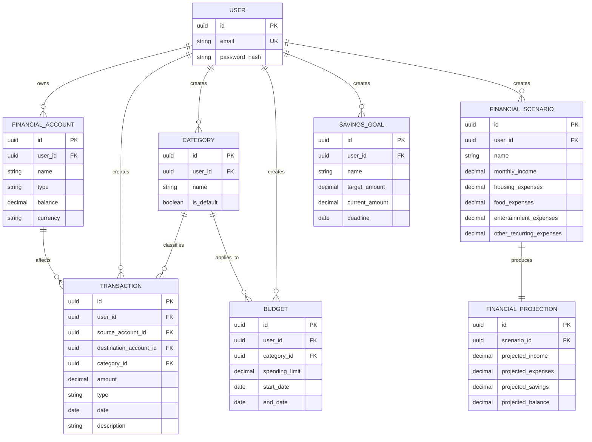

# Database Design

This document describes the relational database structure of the Personal Finance Manager application.

The database design is derived from the Domain Model and Functional Requirements.

## 1. Database Overview

The database will contain the following main entities:

* User
* Financial Account
* Transaction
* Category
* Budget
* Savings Goal
* Financial Scenario
* Financial Projection

The database will use a relational structure with foreign keys to maintain relationships between entities.

## 2. Entity Relationship Diagram



## 3. Tables

### 3.1 User

Stores user authentication and account information.

| Column          | Type    | Constraints      |
| --------------- | ------- | ---------------- |
| `id`            | UUID    | Primary Key      |
| `email`         | VARCHAR | NOT NULL, UNIQUE |
| `password_hash` | VARCHAR | NOT NULL         |

---

### 3.2 Financial Account

Stores financial accounts belonging to users.

| Column     | Type    | Constraints        |
| ---------- | ------- | ------------------ |
| `id`       | UUID    | Primary Key        |
| `user_id`  | UUID    | Foreign Key → User |
| `name`     | VARCHAR | NOT NULL           |
| `type`     | VARCHAR | NOT NULL           |
| `balance`  | DECIMAL | NOT NULL           |
| `currency` | VARCHAR | NOT NULL           |

Supported account types:

* Cash
* Bank account
* Credit card
* Savings account

---

### 3.3 Transaction

Stores income, expense, and transfer operations.

| Column                   | Type    | Constraints                           |
| ------------------------ | ------- | ------------------------------------- |
| `id`                     | UUID    | Primary Key                           |
| `user_id`                | UUID    | Foreign Key → User                    |
| `source_account_id`      | UUID    | Foreign Key → Financial Account, NULL |
| `destination_account_id` | UUID    | Foreign Key → Financial Account, NULL |
| `category_id`            | UUID    | Foreign Key → Category, NULL          |
| `amount`                 | DECIMAL | NOT NULL                              |
| `type`                   | VARCHAR | NOT NULL                              |
| `date`                   | DATE    | NOT NULL                              |
| `description`            | VARCHAR | NULL                                  |

The account relationships depend on the transaction type:

| Transaction Type | Source Account | Destination Account | Category |
| ---------------- | -------------- | ------------------- | -------- |
| Income           | NULL           | Required            | Optional |
| Expense          | Required       | NULL                | Required |
| Transfer         | Required       | Required            | NULL     |

This structure allows transfers to move money between two accounts without treating the transfer as income or expense.

---

### 3.4 Category

Stores transaction categories.

| Column       | Type    | Constraints                                     |
| ------------ | ------- | ----------------------------------------------- |
| `id`         | UUID    | Primary Key                                     |
| `user_id`    | UUID    | Foreign Key → User, NULL for default categories |
| `name`       | VARCHAR | NOT NULL                                        |
| `is_default` | BOOLEAN | NOT NULL                                        |

Default categories include:

* Food
* Transport
* Housing
* Entertainment
* Shopping
* Health
* Education
* Subscriptions
* Other

Custom categories belong to the user who created them.

---

### 3.5 Budget

Stores spending limits defined for categories and periods.

| Column           | Type    | Constraints            |
| ---------------- | ------- | ---------------------- |
| `id`             | UUID    | Primary Key            |
| `user_id`        | UUID    | Foreign Key → User     |
| `category_id`    | UUID    | Foreign Key → Category |
| `spending_limit` | DECIMAL | NOT NULL               |
| `start_date`     | DATE    | NOT NULL               |
| `end_date`       | DATE    | NOT NULL               |

The following values are calculated from transactions and are not stored directly:

* Amount spent
* Remaining amount
* Percentage used
* Overspending status

---

### 3.6 Savings Goal

Stores financial goals created by users.

| Column           | Type    | Constraints        |
| ---------------- | ------- | ------------------ |
| `id`             | UUID    | Primary Key        |
| `user_id`        | UUID    | Foreign Key → User |
| `name`           | VARCHAR | NOT NULL           |
| `target_amount`  | DECIMAL | NOT NULL           |
| `current_amount` | DECIMAL | NOT NULL           |
| `deadline`       | DATE    | NOT NULL           |

The following values are calculated rather than stored:

* Remaining amount
* Goal progress
* Required average monthly savings
* Goal achievability

---

### 3.7 Financial Scenario

Stores hypothetical financial scenarios created by users.

| Column                     | Type    | Constraints        |
| -------------------------- | ------- | ------------------ |
| `id`                       | UUID    | Primary Key        |
| `user_id`                  | UUID    | Foreign Key → User |
| `name`                     | VARCHAR | NOT NULL           |
| `monthly_income`           | DECIMAL | NOT NULL           |
| `housing_expenses`         | DECIMAL | NOT NULL           |
| `food_expenses`            | DECIMAL | NOT NULL           |
| `entertainment_expenses`   | DECIMAL | NOT NULL           |
| `other_recurring_expenses` | DECIMAL | NOT NULL           |

A financial scenario represents hypothetical values and must not modify actual financial data.

---

### 3.8 Financial Projection

Stores the result of a financial scenario simulation.

| Column               | Type    | Constraints                              |
| -------------------- | ------- | ---------------------------------------- |
| `id`                 | UUID    | Primary Key                              |
| `scenario_id`        | UUID    | Foreign Key → Financial Scenario, UNIQUE |
| `projected_income`   | DECIMAL | NOT NULL                                 |
| `projected_expenses` | DECIMAL | NOT NULL                                 |
| `projected_savings`  | DECIMAL | NOT NULL                                 |
| `projected_balance`  | DECIMAL | NOT NULL                                 |

A projection belongs to exactly one financial scenario.

The projection values are calculated from the scenario parameters and the user's current financial situation.

## 4. Relationships

### User → Financial Account

One user can own zero or more financial accounts.

```text
User 1 ──────── 0..* FinancialAccount
```

### User → Transaction

One user can create zero or more transactions.

```text
User 1 ──────── 0..* Transaction
```

### Financial Account → Transaction

A financial account can participate in many transactions.

A transaction can affect one or two accounts depending on its type.

```text
FinancialAccount 1 ──────── 0..* Transaction
```

### Category → Transaction

One category can be assigned to many transactions.

A transaction can have zero or one category.

```text
Category 1 ──────── 0..* Transaction
```

### Category → Budget

A category can have multiple budgets for different periods.

Each budget applies to one category.

```text
Category 1 ──────── 0..* Budget
```

### User → Budget

A user can create multiple budgets.

```text
User 1 ──────── 0..* Budget
```

### User → Savings Goal

A user can create multiple savings goals.

```text
User 1 ──────── 0..* SavingsGoal
```

### User → Financial Scenario

A user can create multiple financial scenarios.

```text
User 1 ──────── 0..* FinancialScenario
```

### Financial Scenario → Financial Projection

Each scenario produces one projection.

```text
FinancialScenario 1 ──────── 1 FinancialProjection
```

## 5. Data Integrity Rules

The database shall enforce the following rules where possible:

* A financial account must belong to an existing user.
* A transaction must belong to an existing user.
* A transaction may reference only accounts belonging to the same user.
* A budget must belong to an existing user and category.
* A savings goal must belong to an existing user.
* A financial scenario must belong to an existing user.
* A financial projection must belong to an existing financial scenario.
* Monetary values shall use `DECIMAL` rather than floating-point types.
* Budget `end_date` must not be earlier than `start_date`.
* Savings goal `target_amount` must be greater than zero.
* Transaction `amount` must be greater than zero.
* Budget `spending_limit` must not be negative.
* Savings goal `current_amount` must not be negative.

Transaction-specific rules:

* Income requires a destination account.
* Expense requires a source account and category.
* Transfer requires both a source and destination account.
* A transfer cannot use the same account as both source and destination.
* A transfer should not have a category.

## 6. Calculated Data

The following information should be calculated rather than stored as independent database fields.

### Account Balance

The account balance is affected by its transactions.

```text
Balance =
Initial Balance
+ Income
- Expenses
+ Incoming Transfers
- Outgoing Transfers
```

### Savings

```text
Savings = Income - Expenses
```

### Budget Usage

```text
Amount Spent =
Sum of Expense Transactions
for the Budget Category
within the Budget Period
```

### Savings Goal Progress

```text
Remaining Amount =
Target Amount - Current Amount
```

### Financial Projection

```text
Projected Savings =
Projected Income - Projected Expenses
```

Calculated values should not be duplicated in the database unless there is a later performance-related reason to do so.

## 7. Database Design Decisions

### UUID Primary Keys

Entities use UUID identifiers to provide unique identifiers without relying on sequential numeric IDs.

### Decimal Monetary Values

All monetary amounts use `DECIMAL` to avoid floating-point precision errors.

### Foreign Keys

Foreign keys are used to maintain referential integrity between related entities.

### Derived Values

Values that can be reliably calculated from existing data are not stored as independent fields.

This reduces data duplication and prevents inconsistencies between stored and calculated values.

### User Data Isolation

Every user-owned financial entity is associated with a `User`.

Queries involving financial data must ensure that users can access only their own records.
