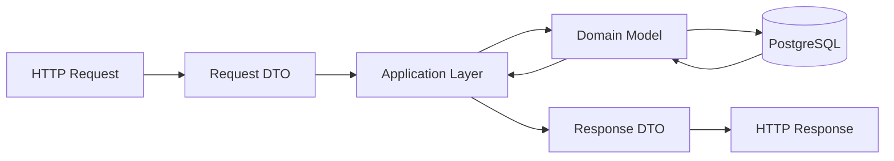

# API Design

This document describes the REST API of the Personal Finance Manager backend.

The API provides access to authentication, financial accounts, transactions, categories, budgets, savings goals, financial statistics, and the What-If Simulator.

## 1. API Principles

The API follows REST principles and uses HTTP methods to represent operations on resources.

| Method   | Purpose                                   |
| -------- | ----------------------------------------- |
| `GET`    | Retrieve data                             |
| `POST`   | Create a resource or perform an operation |
| `PUT`    | Replace or update an existing resource    |
| `DELETE` | Delete a resource                         |

The API uses JSON for request and response bodies.

Protected endpoints require authentication.

Users can only access resources belonging to their account.

## 2. Base URL

```text
/api
```

Resource endpoints are grouped by functional area.

```text
/api/auth
/api/accounts
/api/transactions
/api/categories
/api/budgets
/api/savings-goals
/api/statistics
/api/simulations
```

## 3. Authentication API

### Register

```http
POST /api/auth/register
```

Creates a new user account.

Request:

```json
{
  "email": "user@example.com",
  "password": "password",
  "passwordConfirmation": "password"
}
```

Response:

```http
201 Created
```

### Log In

```http
POST /api/auth/login
```

Authenticates a user.

Request:

```json
{
  "email": "user@example.com",
  "password": "password"
}
```

Response:

```http
200 OK
```

The response contains the authentication information required to access protected endpoints.

### Log Out

```http
POST /api/auth/logout
```

Logs out the authenticated user.

Response:

```http
204 No Content
```

## 4. Financial Accounts API

### Create Account

```http
POST /api/accounts
```

Creates a financial account.

Request:

```json
{
  "name": "Main Bank Account",
  "type": "BankAccount",
  "initialBalance": 2500.00,
  "currency": "PLN"
}
```

### Get Accounts

```http
GET /api/accounts
```

Returns the authenticated user's financial accounts.

### Get Account

```http
GET /api/accounts/{id}
```

Returns a specific financial account.

### Update Account

```http
PUT /api/accounts/{id}
```

Updates an existing financial account.

### Delete Account

```http
DELETE /api/accounts/{id}
```

Deletes a financial account.

An account cannot be deleted if doing so would violate financial data integrity.

## 5. Transactions API

### Create Transaction

```http
POST /api/transactions
```

Creates an income, expense, or transfer.

Example expense:

```json
{
  "amount": 45.50,
  "type": "Expense",
  "categoryId": "category-id",
  "sourceAccountId": "account-id",
  "date": "2026-09-07",
  "description": "Lunch"
}
```

Example transfer:

```json
{
  "amount": 500.00,
  "type": "Transfer",
  "sourceAccountId": "account-id-1",
  "destinationAccountId": "account-id-2",
  "date": "2026-09-07",
  "description": "Transfer to savings"
}
```

The API validates the fields required for the selected transaction type.

### Get Transactions

```http
GET /api/transactions
```

Returns the authenticated user's transactions.

### Filter Transactions

```http
GET /api/transactions?from=2026-09-01&to=2026-09-30&categoryId={id}&type=Expense&accountId={id}
```

Supported filters:

* Date range
* Category
* Transaction type
* Account

### Sort Transactions

```http
GET /api/transactions?sortBy=date&sortOrder=desc
```

Supported sorting fields:

* Date
* Amount

### Get Transaction

```http
GET /api/transactions/{id}
```

Returns a specific transaction.

### Update Transaction

```http
PUT /api/transactions/{id}
```

Updates an existing transaction.

If the transaction affects account balances, the affected balances must be updated atomically.

### Delete Transaction

```http
DELETE /api/transactions/{id}
```

Deletes a transaction and reverses its effect on affected account balances.

## 6. Categories API

### Create Category

```http
POST /api/categories
```

Creates a custom category.

Request:

```json
{
  "name": "Pets"
}
```

### Get Categories

```http
GET /api/categories
```

Returns the categories available to the authenticated user, including predefined categories.

### Update Category

```http
PUT /api/categories/{id}
```

Updates a custom category.

### Delete Category

```http
DELETE /api/categories/{id}
```

Deletes a custom category.

Default categories cannot be modified or deleted by users.

## 7. Budgets API

### Create Budget

```http
POST /api/budgets
```

Request:

```json
{
  "categoryId": "category-id",
  "spendingLimit": 800.00,
  "startDate": "2026-09-01",
  "endDate": "2026-09-30"
}
```

### Get Budgets

```http
GET /api/budgets
```

Returns the authenticated user's budgets.

### Get Budget

```http
GET /api/budgets/{id}
```

Returns a specific budget including calculated usage information.

### Update Budget

```http
PUT /api/budgets/{id}
```

Updates an existing budget.

### Delete Budget

```http
DELETE /api/budgets/{id}
```

Deletes a budget.

## 8. Savings Goals API

### Create Savings Goal

```http
POST /api/savings-goals
```

Request:

```json
{
  "name": "New Laptop",
  "targetAmount": 5000.00,
  "currentAmount": 1500.00,
  "deadline": "2027-06-01"
}
```

### Get Savings Goals

```http
GET /api/savings-goals
```

Returns the authenticated user's savings goals.

### Get Savings Goal

```http
GET /api/savings-goals/{id}
```

Returns a specific savings goal including calculated progress information.

### Update Savings Goal

```http
PUT /api/savings-goals/{id}
```

Updates an existing savings goal.

### Delete Savings Goal

```http
DELETE /api/savings-goals/{id}
```

Deletes a savings goal.

## 9. Dashboard API

The dashboard combines information from multiple resources.

### Get Dashboard

```http
GET /api/dashboard?from=2026-09-01&to=2026-09-30
```

Returns an overview of the user's financial situation for the selected period.

The response may contain:

```json
{
  "totalBalance": 6500.00,
  "income": 5000.00,
  "expenses": 3200.00,
  "savings": 1800.00,
  "recentTransactions": [],
  "spendingByCategory": [],
  "incomeVsExpenses": {}
}
```

The dashboard does not represent a separate database entity.

## 10. Financial Statistics API

### Get Statistics

```http
GET /api/statistics?from=2026-09-01&to=2026-09-30
```

Returns financial statistics for the selected period.

Possible data:

* Total income
* Total expenses
* Savings
* Spending by category

### Compare Periods

```http
GET /api/statistics/compare?from=2026-08-01&to=2026-08-31&compareFrom=2026-09-01&compareTo=2026-09-30
```

Compares financial statistics between two periods.

## 11. What-If Simulator API

The What-If Simulator is based on hypothetical financial scenarios.

### Create Scenario

```http
POST /api/simulations
```

Request:

```json
{
  "name": "Reduce Food Expenses",
  "monthlyIncome": 5000.00,
  "housingExpenses": 1500.00,
  "foodExpenses": 600.00,
  "entertainmentExpenses": 300.00,
  "otherRecurringExpenses": 500.00
}
```

### Get Scenarios

```http
GET /api/simulations
```

Returns the user's saved financial scenarios.

### Get Scenario

```http
GET /api/simulations/{id}
```

Returns a specific scenario.

### Update Scenario

```http
PUT /api/simulations/{id}
```

Updates the hypothetical parameters of a scenario.

### Delete Scenario

```http
DELETE /api/simulations/{id}
```

Deletes a saved scenario.

### Run Simulation

```http
POST /api/simulations/{id}/run
```

Runs the selected financial scenario.

The API calculates a financial projection based on:

* Current financial situation
* Scenario parameters
* Existing budgets
* Existing savings goals

Example response:

```json
{
  "projectedIncome": 5000.00,
  "projectedExpenses": 2900.00,
  "projectedSavings": 2100.00,
  "projectedBalance": 7100.00
}
```

The projection is calculated dynamically and is not stored as a separate database entity.

## 12. HTTP Status Codes

The API uses standard HTTP status codes.

| Status                      | Meaning                                      |
| --------------------------- | -------------------------------------------- |
| `200 OK`                    | Request completed successfully               |
| `201 Created`               | Resource created successfully                |
| `204 No Content`            | Operation completed without response body    |
| `400 Bad Request`           | Invalid request data                         |
| `401 Unauthorized`          | Authentication required or failed            |
| `403 Forbidden`             | User is not allowed to perform the operation |
| `404 Not Found`             | Resource does not exist                      |
| `409 Conflict`              | Operation conflicts with existing data       |
| `500 Internal Server Error` | Unexpected server error                      |

## 13. Validation and Error Responses

Invalid requests should return a consistent error format.

Example:

```json
{
  "status": 400,
  "title": "Validation Error",
  "errors": {
    "amount": [
      "Amount must be greater than zero."
    ]
  }
}
```

The API must not expose sensitive information through error messages.

## 14. Pagination

Large collections, especially transactions, should support pagination.

Example:

```http
GET /api/transactions?page=1&pageSize=20
```

A paginated response may contain:

```json
{
  "items": [],
  "page": 1,
  "pageSize": 20,
  "totalItems": 125,
  "totalPages": 7
}
```

## 15. API and Domain Separation

The API should not expose database entities directly.

The backend should use DTOs for communication with the frontend.



This keeps the API contract independent from the database implementation.

## 16. API Design Principles

The API should follow these principles:

* Use resource-oriented URLs.
* Use HTTP methods according to the operation.
* Use JSON for request and response bodies.
* Require authentication for protected resources.
* Enforce user data isolation.
* Validate all incoming data.
* Return appropriate HTTP status codes.
* Use DTOs instead of exposing database entities.
* Keep financial operations atomic.
* Do not expose sensitive information.
* Support pagination for large collections.
