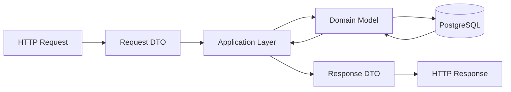

# API Design

This document describes the REST API of the Personal Finance Manager backend.

The implemented API provides authentication, financial accounts, categories, and
a database connectivity check. Transactions, budgets, savings goals, dashboard,
statistics, and simulations below are **planned contracts**, not available endpoints.
See [Backend Status](backend-status.md) for implementation gaps.

## 1. API Principles

The API follows REST principles and uses HTTP methods to represent operations on resources.

| Method   | Purpose                                   |
| -------- | ----------------------------------------- |
| `GET`    | Retrieve data                             |
| `POST`   | Create a resource or perform an operation |
| `PUT`    | Replace or update an existing resource    |
| `DELETE` | Delete a resource                         |

Request DTOs and successful data responses use camelCase JSON. Some errors are
plain-text strings, framework Problem Details, or empty responses; there is no
single application-wide error envelope.

Protected endpoints require authentication.

Account queries are scoped to the authenticated user. Category queries include
that user's custom categories and shared defaults. Resource IDs are integers.

## 2. Base URL

```text
/api
```

Resource endpoints are grouped by functional area.

```text
/api/auth
/api/accounts
/api/categories
/api/health/database
```

Docker exposes the API at `http://localhost:8080`. The `http` launch profile uses
`http://localhost:5001`. Send `Authorization: Bearer <token>` for protected routes.
Swagger UI is available at `/swagger` and its JSON at `/swagger/v1/swagger.json`.

## 3. Authentication API

### Register

```http
POST /api/auth/register
```

Creates a new user account.

Request:

```json
{
  "email": "user@example.com",
  "password": "password",
  "passwordConfirmation": "password"
}
```

Response:

```http
201 Created
```

The response is `{ "id": 1, "email": "user@example.com", "createdAt": "2026-09-23T09:00:00Z" }`.
Password mismatch returns `400`; an existing exact-match email returns `409`.
Email comparison is case-sensitive and does not trim whitespace. The backend has
no explicit email-format or password-strength validators and no database unique
index on email; concurrent duplicate registrations are not prevented. Missing/null
non-nullable string properties are handled by framework model validation.

### Log In

```http
POST /api/auth/login
```

Authenticates a user.

Request:

```json
{
  "email": "user@example.com",
  "password": "password"
}
```

Response:

```http
200 OK
```

The response is `{ "token": "<JWT>" }`. Invalid credentials return `401`.
Tokens use HS256 and contain user ID and email claims, with an expiry set one hour
after issuance. Issuer, audience, signature, and lifetime are validated. The code
does not override the token validator's clock-skew setting. There is no refresh-token flow.

### Current User

```http
GET /api/auth/me
```

Requires a bearer token and returns `200` with `{ "userId": "1" }`. The value is
the ID claim as a string, not a complete user profile or a database lookup.

### Log Out (client-side)

There is no backend logout endpoint. The frontend removes the token from local
storage and clears its authentication state. This does not revoke an issued JWT.

## 4. Financial Accounts API

### Create Account

```http
POST /api/accounts
```

Creates a financial account.

All account routes require a bearer token. Creation returns `201` and a `Location`
header pointing to `GET /api/accounts/{id}`. `balance` starts at `initialBalance`.
The create response currently serializes the entity, including `userId` and the
`user` navigation property (normally null); list/detail responses use `AccountResponse`.

Request:

```json
{
  "name": "Main Bank Account",
  "type": "BankAccount",
  "initialBalance": 2500.00,
  "currency": "PLN"
}
```

Validation and storage behavior:

* `name` is required and at most 100 characters; names are not trimmed or unique.
* Named account types are `Cash`, `BankAccount`, `CreditCard`, `SavingsAccount`.
  The enum converter also accepts integer values, without an enum-membership
  validator. Omitting `type` currently defaults to `Cash`.
* `initialBalance` accepts negatives and the range -9999999999999999.99 through
  9999999999999999.99. Omitting it defaults to zero. PostgreSQL stores two decimal places.
* Currency validation accepts `PLN`, `EUR`, `USD`, `GBP`, `CHF`, and `UAH`,
  case-insensitively; the submitted casing is stored. The current error message
  omits `UAH` even though it is accepted.

### Get Accounts

```http
GET /api/accounts
```

Returns the authenticated user's financial accounts.

Returns `200` with an array (empty when no accounts exist). There is no pagination,
filtering, or guaranteed ordering. Each item contains `id`, `name`, `type`,
`initialBalance`, `balance`, `currency`, and `createdAt`.

### Get Account

```http
GET /api/accounts/{id}
```

Returns a specific financial account.

Returns `200` with the same fields as a list item, or `404` for a missing account
or an account owned by another user.

### Update Account

```http
PUT /api/accounts/{id}
```

Updates an existing financial account.

Accepts `{ "name": "Savings", "type": "SavingsAccount", "currency": "EUR" }`.
Only these three fields are changed; balances cannot be edited through this route.
Changing currency relabels the account without converting its balance. Returns
`204`, or `404` for a missing/other user's account.

### Delete Account

```http
DELETE /api/accounts/{id}
```

Deletes a financial account.

Returns `204`, or `404` for a missing/other user's account. The current endpoint
hard-deletes the account. There is no transaction-reference deletion check because
the transaction module is not implemented.

## 5. Transactions API (planned)

No transaction endpoints, model, or migration exist yet. This section is a proposal.

### Create Transaction

```http
POST /api/transactions
```

Creates an income, expense, or transfer.

Example expense:

```json
{
  "amount": 45.50,
  "type": "Expense",
  "categoryId": -1,
  "sourceAccountId": 1,
  "date": "2026-09-07",
  "description": "Lunch"
}
```

Example transfer:

```json
{
  "amount": 500.00,
  "type": "Transfer",
  "sourceAccountId": 1,
  "destinationAccountId": 2,
  "date": "2026-09-07",
  "description": "Transfer to savings"
}
```

The API validates the fields required for the selected transaction type.

### Get Transactions

```http
GET /api/transactions
```

Returns the authenticated user's transactions.

### Filter Transactions

```http
GET /api/transactions?from=2026-09-01&to=2026-09-30&categoryId={id}&type=Expense&accountId={id}
```

Supported filters:

* Date range
* Category
* Transaction type
* Account

### Sort Transactions

```http
GET /api/transactions?sortBy=date&sortOrder=desc
```

Supported sorting fields:

* Date
* Amount

### Get Transaction

```http
GET /api/transactions/{id}
```

Returns a specific transaction.

### Update Transaction

```http
PUT /api/transactions/{id}
```

Updates an existing transaction.

If the transaction affects account balances, the affected balances must be updated atomically.

### Delete Transaction

```http
DELETE /api/transactions/{id}
```

Deletes a transaction and reverses its effect on affected account balances.

## 6. Categories API

### Create Category

```http
POST /api/categories
```

Creates a custom category.

Request:

```json
{
  "name": "Pets"
}
```

### Get Categories

```http
GET /api/categories
```

Returns the categories available to the authenticated user, including predefined categories.

### Update Category

```http
PUT /api/categories/{id}
```

Updates a custom category.

### Delete Category

```http
DELETE /api/categories/{id}
```

Deletes a custom category.

Default categories cannot be modified or deleted by users.

#### Implemented category contract

All category endpoints require a bearer token. IDs are integers, matching the
existing backend's user and account IDs.
Responses contain `id`, `name`, and `isDefault`:

```json
{ "id": 1, "name": "Pets", "isDefault": false }
```

* `GET /api/categories` returns an alphabetically sorted array containing the nine
  defaults and only the caller's custom categories, for the Figma category dropdown.
* `GET /api/categories/{id}` returns one available category.
* `POST /api/categories` accepts `{ "name": "Pets" }`, returns `201` with the
  created category and a `Location` header, allowing the dropdown to select it.
* `PUT /api/categories/{id}` accepts the same body and returns `204`.
* `DELETE /api/categories/{id}` returns `204`.
* Names are required, at most 100 characters, and trimmed before storage.
  Custom names are unique per user, ignoring case and surrounding whitespace;
  duplicates return `409`, including simultaneous requests.
  Different users may reuse a name; a custom category may also share a default's name.
* Invalid input returns `400`, unauthenticated calls `401`, modifications of
  defaults `403`, and missing or another user's category `404`.

Defaults are seeded by the `AddCategories` migration. Apply migrations before
starting the API with `dotnet ef database update --project backend`.
The Figma dropdown's “Transfer” entry is not seeded: the documented transaction
rules specify that transfers have no category. Transaction and budget assignment
will use these IDs when those backend modules are implemented.

For integration checks, start the API against a **disposable migrated PostgreSQL
database**, then run:

```sh
node backend/tests/categories.integration.mjs http://localhost:5088
```

The test creates two users and checks defaults, validation, ownership, CRUD,
duplicate-name conflicts, and concurrent creation. It leaves its test data in
that disposable database.

## 7. Budgets API (planned)

No budget endpoints, model, or migration exist yet.

### Create Budget

```http
POST /api/budgets
```

Request:

```json
{
  "categoryId": -1,
  "spendingLimit": 800.00,
  "startDate": "2026-09-01",
  "endDate": "2026-09-30"
}
```

### Get Budgets

```http
GET /api/budgets
```

Returns the authenticated user's budgets.

### Get Budget

```http
GET /api/budgets/{id}
```

Returns a specific budget including calculated usage information.

### Update Budget

```http
PUT /api/budgets/{id}
```

Updates an existing budget.

### Delete Budget

```http
DELETE /api/budgets/{id}
```

Deletes a budget.

## 8. Savings Goals API (planned)

No savings-goal endpoints, model, or migration exist yet.

### Create Savings Goal

```http
POST /api/savings-goals
```

Request:

```json
{
  "name": "New Laptop",
  "targetAmount": 5000.00,
  "currentAmount": 1500.00,
  "deadline": "2027-06-01"
}
```

### Get Savings Goals

```http
GET /api/savings-goals
```

Returns the authenticated user's savings goals.

### Get Savings Goal

```http
GET /api/savings-goals/{id}
```

Returns a specific savings goal including calculated progress information.

### Update Savings Goal

```http
PUT /api/savings-goals/{id}
```

Updates an existing savings goal.

### Delete Savings Goal

```http
DELETE /api/savings-goals/{id}
```

Deletes a savings goal.

## 9. Dashboard API (planned)

There is no dashboard endpoint in the current backend.

The dashboard combines information from multiple resources.

### Get Dashboard

```http
GET /api/dashboard?from=2026-09-01&to=2026-09-30
```

Returns an overview of the user's financial situation for the selected period.

The response may contain:

```json
{
  "totalBalance": 6500.00,
  "income": 5000.00,
  "expenses": 3200.00,
  "savings": 1800.00,
  "recentTransactions": [],
  "spendingByCategory": [],
  "incomeVsExpenses": {}
}
```

The dashboard does not represent a separate database entity.

## 10. Financial Statistics API (planned)

There are no statistics endpoints in the current backend.

### Get Statistics

```http
GET /api/statistics?from=2026-09-01&to=2026-09-30
```

Returns financial statistics for the selected period.

Possible data:

* Total income
* Total expenses
* Savings
* Spending by category

### Compare Periods

```http
GET /api/statistics/compare?from=2026-08-01&to=2026-08-31&compareFrom=2026-09-01&compareTo=2026-09-30
```

Compares financial statistics between two periods.

## 11. What-If Simulator API (planned)

No simulation endpoints, model, or migration exist yet.

The What-If Simulator is based on hypothetical financial scenarios.

### Create Scenario

```http
POST /api/simulations
```

Request:

```json
{
  "name": "Reduce Food Expenses",
  "monthlyIncome": 5000.00,
  "housingExpenses": 1500.00,
  "foodExpenses": 600.00,
  "entertainmentExpenses": 300.00,
  "otherRecurringExpenses": 500.00
}
```

### Get Scenarios

```http
GET /api/simulations
```

Returns the user's saved financial scenarios.

### Get Scenario

```http
GET /api/simulations/{id}
```

Returns a specific scenario.

### Update Scenario

```http
PUT /api/simulations/{id}
```

Updates the hypothetical parameters of a scenario.

### Delete Scenario

```http
DELETE /api/simulations/{id}
```

Deletes a saved scenario.

### Run Simulation

```http
POST /api/simulations/{id}/run
```

Runs the selected financial scenario.

The API calculates a financial projection based on:

* Current financial situation
* Scenario parameters
* Existing budgets
* Existing savings goals

Example response:

```json
{
  "projectedIncome": 5000.00,
  "projectedExpenses": 2900.00,
  "projectedSavings": 2100.00,
  "projectedBalance": 7100.00
}
```

The projection is calculated dynamically and is not stored as a separate database entity.

## 12. HTTP Status Codes

The API uses standard HTTP status codes.

| Status                      | Meaning                                      |
| --------------------------- | -------------------------------------------- |
| `200 OK`                    | Request completed successfully               |
| `201 Created`               | Resource created successfully                |
| `204 No Content`            | Operation completed without response body    |
| `400 Bad Request`           | Invalid request data                         |
| `401 Unauthorized`          | Authentication required or failed            |
| `403 Forbidden`             | User is not allowed to perform the operation |
| `404 Not Found`             | Resource does not exist                      |
| `409 Conflict`              | Operation conflicts with existing data       |
| `500 Internal Server Error` | Unexpected server error                      |

## 13. Validation and Error Responses

DTO/model-binding failures use ASP.NET Core validation Problem Details. For example,
a missing category name produces a `400` with an `errors.Name` entry. Framework
responses may additionally contain `type` and `traceId`.

Example:

```json
{
  "status": 400,
  "title": "One or more validation errors occurred.",
  "errors": {
    "Name": [
      "The Name field is required."
    ]
  }
}
```

Controller errors such as category conflicts or password mismatches return strings.
Authentication challenges may have no body. A unified error format and sanitized
database-health errors remain outstanding requirements.

### Database Connectivity (implemented)

`GET /api/health/database` is public. A successful connection returns `200` with
`{ "connected": true, "state": "Open" }`. A failure returns `500` with
`connected: false`, `error` (exception message), and `type` (exception type).
It checks connectivity, not migration status or the existence of tables.

## 14. Pagination (planned)

Neither of the implemented list endpoints supports pagination.

Large collections, especially transactions, should support pagination.

Example:

```http
GET /api/transactions?page=1&pageSize=20
```

A paginated response may contain:

```json
{
  "items": [],
  "page": 1,
  "pageSize": 20,
  "totalItems": 125,
  "totalPages": 7
}
```

## 15. API and Domain Separation (target design)

Currently, account reads and category responses use DTOs, but account creation
returns an entity. Controllers access `AppDbContext` directly; only authentication
uses a separate service. The following diagram is a target, not the current call path.

The API should not expose database entities directly.

The backend should use DTOs for communication with the frontend.



This keeps the API contract independent from the database implementation.

## 16. API Design Principles (targets)

The API should follow these principles:

* Use resource-oriented URLs.
* Use HTTP methods according to the operation.
* Use JSON for request and response bodies.
* Require authentication for protected resources.
* Enforce user data isolation.
* Validate all incoming data.
* Return appropriate HTTP status codes.
* Use DTOs instead of exposing database entities.
* Keep financial operations atomic.
* Do not expose sensitive information.
* Support pagination for large collections.
