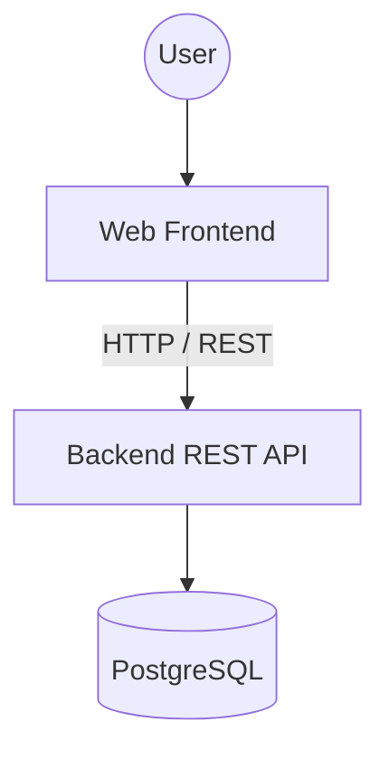
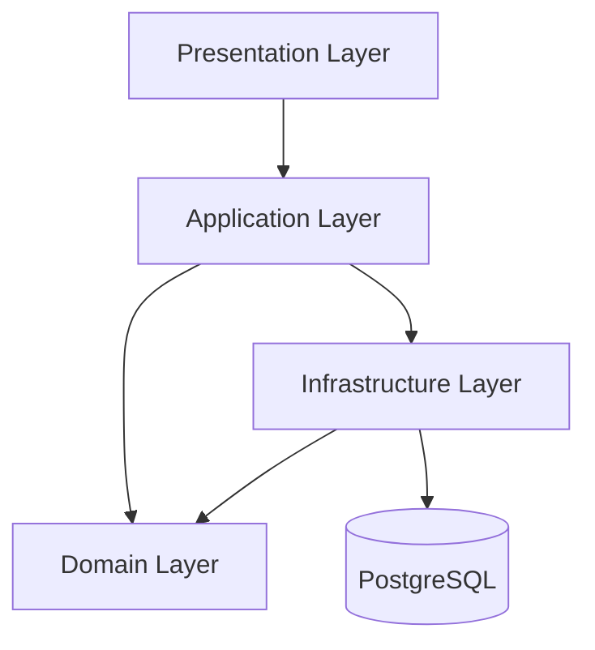
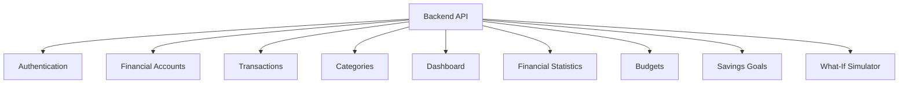
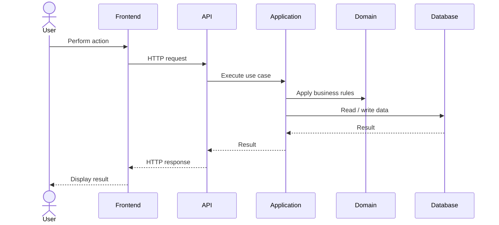
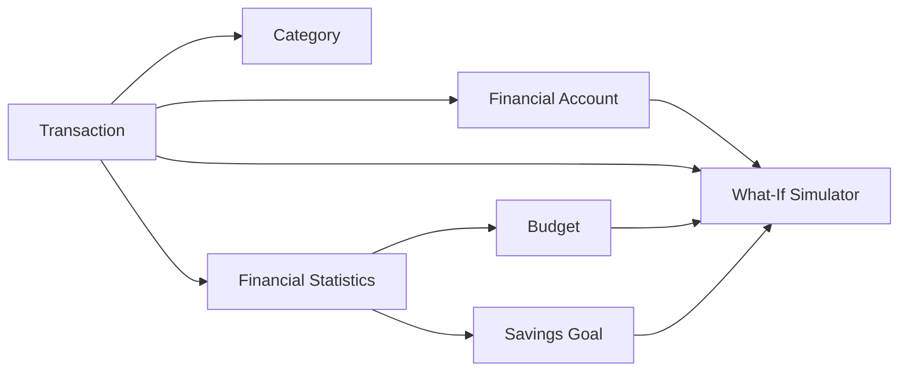
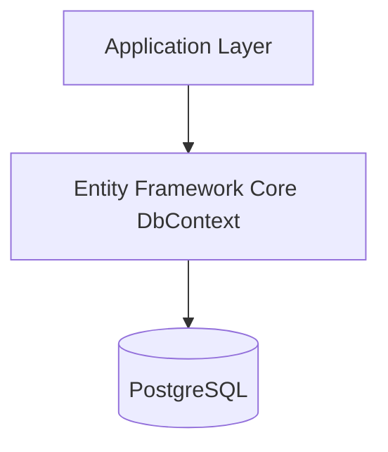
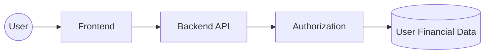
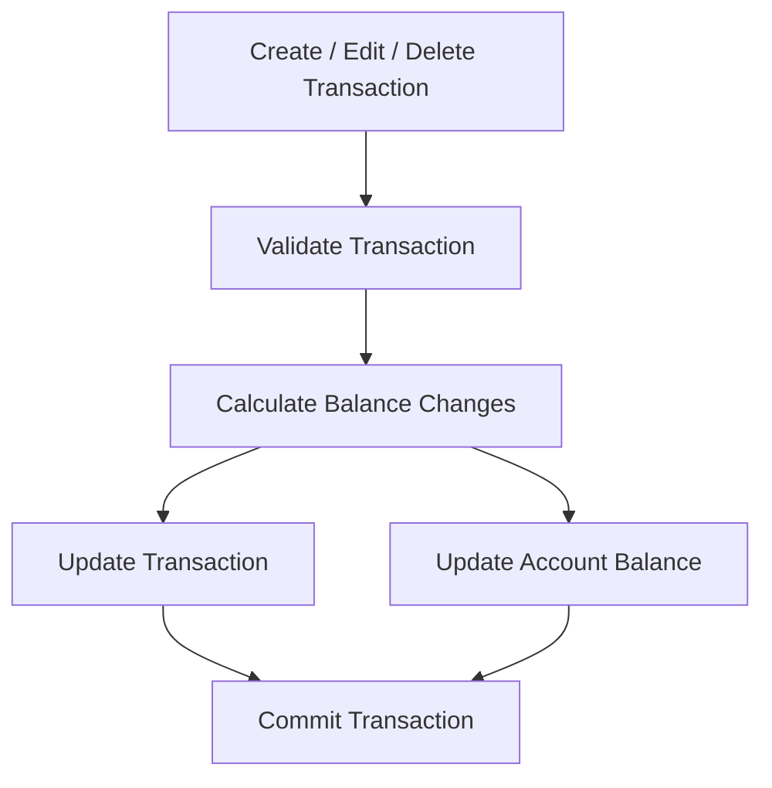
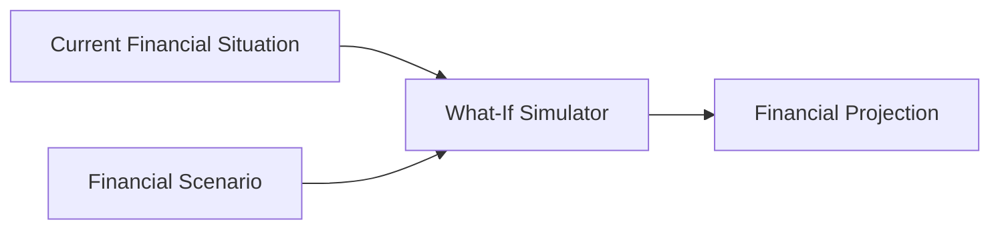

# System Architecture

## 1. Architecture Overview

Personal Finance Manager will use a **modular monolith architecture**.

The application will consist of a web frontend, a backend REST API, and a PostgreSQL database.

The backend will be internally divided into layers with clearly separated responsibilities.



The main goal of the architecture is to keep the application modular, testable, and easy to maintain while avoiding unnecessary complexity.

---

## 2. Backend Architecture

The backend will use a layered architecture.



### Presentation Layer

Responsible for communication with the frontend.

Responsibilities include:

* HTTP endpoints
* Request handling
* Response formatting
* Authentication and authorization
* Input validation
* HTTP status codes

The Presentation Layer should not contain core business logic.

---

### Application Layer

Responsible for application use cases and orchestration of business operations.

Responsibilities include:

* Creating and modifying transactions
* Managing financial accounts
* Creating budgets
* Managing savings goals
* Running financial simulations
* Calculating financial statistics
* Coordinating domain operations

The Application Layer coordinates operations between the Presentation, Domain, and Infrastructure layers.

---

### Domain Layer

Contains the core business concepts and rules of the application.

The main domain entities are:

* User
* Financial Account
* Transaction
* Category
* Budget
* Savings Goal
* Financial Scenario

The Domain Layer should not depend on the database, web framework, or UI.

Business rules such as transaction types, budget rules, and financial calculations belong to the domain or application logic rather than the Presentation Layer.

---

### Infrastructure Layer

Responsible for communication with external systems and technical implementation details.

Responsibilities include:

* Database access
* Entity Framework Core
* PostgreSQL integration
* Authentication infrastructure
* Password hashing
* External services when required

The Infrastructure Layer implements technical details required by the Application and Domain layers.

---

## 3. Application Modules

The backend will be divided into modules based on the application's functional areas.



Each module should have a clearly defined responsibility.

### Authentication

Responsible for:

* User registration
* User authentication
* Logout
* Password management
* Access control

### Financial Accounts

Responsible for:

* Creating accounts
* Viewing accounts
* Editing accounts
* Deleting accounts
* Maintaining account balances

### Transactions

Responsible for:

* Creating transactions
* Viewing transactions
* Editing transactions
* Deleting transactions
* Filtering transactions
* Sorting transactions
* Updating affected account balances

### Categories

Responsible for:

* Default categories
* Custom categories
* Category management
* Assigning categories to transactions

### Dashboard

Responsible for providing an overview of the user's financial situation.

The dashboard combines data from other modules rather than storing separate dashboard data.

### Financial Statistics

Responsible for:

* Income calculations
* Expense calculations
* Savings calculations
* Spending by category
* Period comparisons

### Budgets

Responsible for:

* Creating budgets
* Managing budgets
* Calculating budget usage
* Detecting overspending

### Savings Goals

Responsible for:

* Creating savings goals
* Tracking progress
* Calculating remaining amounts
* Calculating required monthly savings
* Estimating goal achievability

### What-If Simulator

Responsible for:

* Creating financial scenarios
* Modifying scenario parameters
* Running simulations
* Calculating financial projections
* Comparing scenarios with the current financial situation
* Analyzing impact on budgets and savings goals

The simulator must never modify actual financial data.

---

## 4. Request Flow

A typical request will follow this flow:



For example, when adding an expense:

```text
User
 ↓
Frontend
 ↓
POST /api/transactions
 ↓
Transaction endpoint
 ↓
Create Transaction use case
 ↓
Validate transaction
 ↓
Update account balance
 ↓
Save transaction + balance atomically
 ↓
PostgreSQL
 ↓
HTTP response
 ↓
Frontend
```

---

## 5. Financial Data Flow

Financial data will primarily flow through the following relationships:



The What-If Simulator uses actual financial data as the basis for hypothetical calculations but does not modify that data.

---

## 6. Database Access

The application will use **Entity Framework Core** for database access.



The database will be accessed through the Infrastructure Layer.

The Application Layer should not contain raw database access logic.

---

## 7. Authentication and Authorization

Authentication will identify the current user.

Authorization will ensure that the authenticated user can access only their own financial data.



Every operation involving user-owned financial data must verify ownership.

For example:

```text
GET /api/accounts
```

must return only accounts belonging to the authenticated user.

The same principle applies to:

* Transactions
* Categories
* Budgets
* Savings Goals
* Financial Scenarios

---

## 8. Transaction Processing

Transactions require special handling because they affect account balances.



Transaction changes and account balance changes must be performed atomically.

If the operation fails, neither the transaction nor the balance update should be partially persisted.

---

## 9. What-If Simulator Architecture

The What-If Simulator is separated from actual financial data modification.



The simulator:

1. Reads the current financial situation.
2. Reads the hypothetical scenario parameters.
3. Performs the required calculations.
4. Produces a financial projection.
5. Returns the projection to the user.

The simulator does not modify:

* Transactions
* Financial Accounts
* Budgets
* Savings Goals

Financial projections are calculated dynamically and are not stored as separate database records.

---

## 10. Architectural Principles

The application will follow these principles:

### Separation of Concerns

Each layer and module has a clearly defined responsibility.

### Single Responsibility

Classes and modules should have one primary responsibility.

### Dependency Direction

Business logic should not depend on infrastructure implementation details.

### Testability

Business logic and financial calculations should be testable without requiring a running database or external services.

### Data Integrity

Operations that modify related financial data must preserve consistency.

### Modularity

Functional areas should remain logically separated so that the application can evolve without creating unnecessary dependencies between modules.

### Simplicity

The MVP should avoid unnecessary architectural complexity.

The application will use a modular monolith instead of microservices because the current scope does not require independently deployed services.
