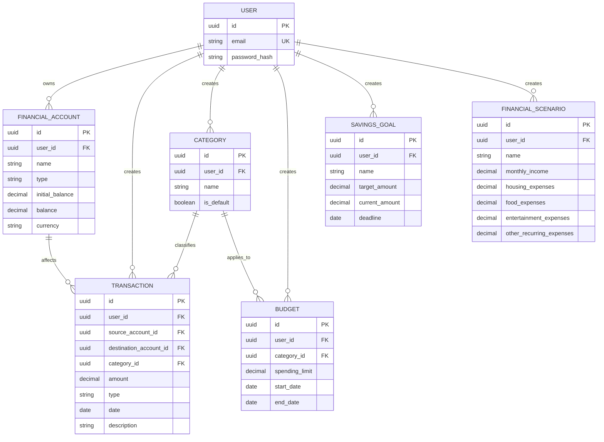

# Database Design

This document describes the relational database structure of the Personal Finance Manager application.

The database design is derived from the Domain Model and Functional Requirements.

## 1. Database Overview

The MVP database contains the following main entities:

* User
* Financial Account
* Transaction
* Category
* Budget
* Savings Goal
* Financial Scenario

The database uses a relational structure with foreign keys to maintain relationships between entities.

## 2. Entity Relationship Diagram



## 3. Tables

### 3.1 User

Stores user authentication information.

| Column          | Type    | Constraints      |
| --------------- | ------- | ---------------- |
| `id`            | UUID    | Primary Key      |
| `email`         | VARCHAR | NOT NULL, UNIQUE |
| `password_hash` | VARCHAR | NOT NULL         |

---

### 3.2 Financial Account

Stores financial accounts belonging to users.

| Column            | Type    | Constraints                  |
| ----------------- | ------- | ---------------------------- |
| `id`              | UUID    | Primary Key                  |
| `user_id`         | UUID    | Foreign Key → User, NOT NULL |
| `name`            | VARCHAR | NOT NULL                     |
| `type`            | VARCHAR | NOT NULL                     |
| `initial_balance` | DECIMAL | NOT NULL                     |
| `balance`         | DECIMAL | NOT NULL                     |
| `currency`        | VARCHAR | NOT NULL                     |

Supported account types:

* Cash
* Bank account
* Credit card
* Savings account

`initial_balance` represents the balance of the account when it was created.

`balance` represents its current balance and is updated when transactions are created, modified, or deleted.

---

### 3.3 Transaction

Stores income, expense, and transfer operations.

| Column                   | Type    | Constraints                           |
| ------------------------ | ------- | ------------------------------------- |
| `id`                     | UUID    | Primary Key                           |
| `user_id`                | UUID    | Foreign Key → User, NOT NULL          |
| `source_account_id`      | UUID    | Foreign Key → Financial Account, NULL |
| `destination_account_id` | UUID    | Foreign Key → Financial Account, NULL |
| `category_id`            | UUID    | Foreign Key → Category, NULL          |
| `amount`                 | DECIMAL | NOT NULL                              |
| `type`                   | VARCHAR | NOT NULL                              |
| `date`                   | DATE    | NOT NULL                              |
| `description`            | VARCHAR | NULL                                  |

Transaction types:

* Income
* Expense
* Transfer

The account and category requirements depend on the transaction type:

| Type     | Source Account | Destination Account | Category |
| -------- | -------------- | ------------------- | -------- |
| Income   | NULL           | Required            | Optional |
| Expense  | Required       | NULL                | Required |
| Transfer | Required       | Required            | NULL     |

A transfer cannot use the same account as both the source and destination.

The `user_id` must match the owner of the accounts referenced by the transaction.

---

### 3.4 Category

Stores predefined and custom transaction categories.

| Column       | Type    | Constraints                                     |
| ------------ | ------- | ----------------------------------------------- |
| `id`         | UUID    | Primary Key                                     |
| `user_id`    | UUID    | Foreign Key → User, NULL for default categories |
| `name`       | VARCHAR | NOT NULL                                        |
| `is_default` | BOOLEAN | NOT NULL                                        |

Default categories include:

* Food
* Transport
* Housing
* Entertainment
* Shopping
* Health
* Education
* Subscriptions
* Other

Default categories are available to users without being owned by a specific user.

Custom categories belong to the user who created them.

A user should not be able to create duplicate category names within their own categories.

---

### 3.5 Budget

Stores spending limits defined for categories and periods.

| Column           | Type    | Constraints                      |
| ---------------- | ------- | -------------------------------- |
| `id`             | UUID    | Primary Key                      |
| `user_id`        | UUID    | Foreign Key → User, NOT NULL     |
| `category_id`    | UUID    | Foreign Key → Category, NOT NULL |
| `spending_limit` | DECIMAL | NOT NULL                         |
| `start_date`     | DATE    | NOT NULL                         |
| `end_date`       | DATE    | NOT NULL                         |

The following values are calculated from transactions:

* Amount spent
* Remaining amount
* Percentage used
* Overspending status

---

### 3.6 Savings Goal

Stores financial goals created by users.

| Column           | Type    | Constraints                  |
| ---------------- | ------- | ---------------------------- |
| `id`             | UUID    | Primary Key                  |
| `user_id`        | UUID    | Foreign Key → User, NOT NULL |
| `name`           | VARCHAR | NOT NULL                     |
| `target_amount`  | DECIMAL | NOT NULL                     |
| `current_amount` | DECIMAL | NOT NULL                     |
| `deadline`       | DATE    | NOT NULL                     |

The following values are calculated rather than stored:

* Remaining amount
* Goal progress
* Required average monthly savings
* Goal achievability

---

### 3.7 Financial Scenario

Stores hypothetical financial scenarios created by users.

| Column                     | Type    | Constraints                  |
| -------------------------- | ------- | ---------------------------- |
| `id`                       | UUID    | Primary Key                  |
| `user_id`                  | UUID    | Foreign Key → User, NOT NULL |
| `name`                     | VARCHAR | NOT NULL                     |
| `monthly_income`           | DECIMAL | NOT NULL                     |
| `housing_expenses`         | DECIMAL | NOT NULL                     |
| `food_expenses`            | DECIMAL | NOT NULL                     |
| `entertainment_expenses`   | DECIMAL | NOT NULL                     |
| `other_recurring_expenses` | DECIMAL | NOT NULL                     |

Scenario values represent hypothetical financial parameters.

Changing a scenario must not modify actual accounts, transactions, budgets, or savings goals.

The financial projection produced by a scenario is calculated by the application and is not stored as a separate database entity.

## 4. Relationships

### User → Financial Account

One user can own zero or more financial accounts.

```text
User 1 ──────── 0..* FinancialAccount
```

### User → Transaction

One user can create zero or more transactions.

```text
User 1 ──────── 0..* Transaction
```

### Financial Account → Transaction

A financial account can participate in many transactions.

A transaction can affect one or two accounts depending on its type.

```text
FinancialAccount 1 ──────── 0..* Transaction
```

### Category → Transaction

One category can be assigned to many transactions.

A transaction can have zero or one category.

```text
Category 1 ──────── 0..* Transaction
```

### Category → Budget

A category can have multiple budgets for different periods.

Each budget applies to one category.

```text
Category 1 ──────── 0..* Budget
```

### User → Budget

A user can create multiple budgets.

```text
User 1 ──────── 0..* Budget
```

### User → Savings Goal

A user can create multiple savings goals.

```text
User 1 ──────── 0..* SavingsGoal
```

### User → Financial Scenario

A user can create multiple financial scenarios.

```text
User 1 ──────── 0..* FinancialScenario
```

## 5. Data Integrity Rules

The database and application logic shall enforce the following rules:

### General Rules

* Every user-owned entity must belong to an existing user.
* Monetary values shall use `DECIMAL`.
* Monetary amounts shall use non-negative values where applicable.
* Foreign keys shall reference existing records.
* Users shall only be able to access their own financial data.

### Account Rules

* `initial_balance` is required when creating an account.
* `balance` must remain consistent with the account's initial balance and transactions.
* `currency` is required.
* Account type must be one of the supported account types.

### Transaction Rules

* `amount` must be greater than zero.
* `type` must be one of: Income, Expense, Transfer.
* Income requires a destination account.
* Expense requires a source account and category.
* Transfer requires both a source and destination account.
* Transfer cannot use the same account as both source and destination.
* Transfer should not have a category.
* Referenced accounts must belong to the same user as the transaction.
* Account balances must be updated atomically with transaction changes.

### Budget Rules

* `spending_limit` must not be negative.
* `end_date` must not be earlier than `start_date`.
* The category must belong to the same user as the budget, or be a default category.

### Savings Goal Rules

* `target_amount` must be greater than zero.
* `current_amount` must not be negative.
* `deadline` must represent a valid future target date when creating a new goal.

### Category Rules

* Category names must not be duplicated within the same user's custom categories.
* Default categories cannot be modified or deleted by users.

## 6. Calculated Data

The following information is calculated by the application rather than stored as independent database fields.

### Account Balance

```text
Balance =
Initial Balance
+ Income
- Expenses
+ Incoming Transfers
- Outgoing Transfers
```

The stored `balance` value must remain consistent with this calculation.

### Savings

```text
Savings = Income - Expenses
```

### Budget Usage

```text
Amount Spent =
Sum of Expense Transactions
for the Budget Category
within the Budget Period
```

### Savings Goal Progress

```text
Remaining Amount =
Target Amount - Current Amount
```

### Financial Projection

```text
Projected Savings =
Projected Income - Projected Expenses
```

Financial projections are generated from the current financial situation and a hypothetical financial scenario.

They are not stored as a separate database entity.

## 7. Design Decisions

### UUID Primary Keys

Entities use UUID identifiers as primary keys.

### Decimal Monetary Values

All monetary amounts use `DECIMAL` to avoid floating-point precision errors.

### Foreign Keys

Foreign keys maintain referential integrity between related entities.

### Derived Values

Values that can be calculated from existing data are not stored as independent database fields unless a future performance requirement justifies storing them.

### User Data Isolation

User-owned financial entities contain a reference to `User`.

Application queries and authorization rules must ensure that users can access only their own financial records.

### Financial Projections

Financial projections are calculated when a scenario is simulated instead of being stored permanently.

This prevents outdated projections from being stored when the user's actual financial data changes.
