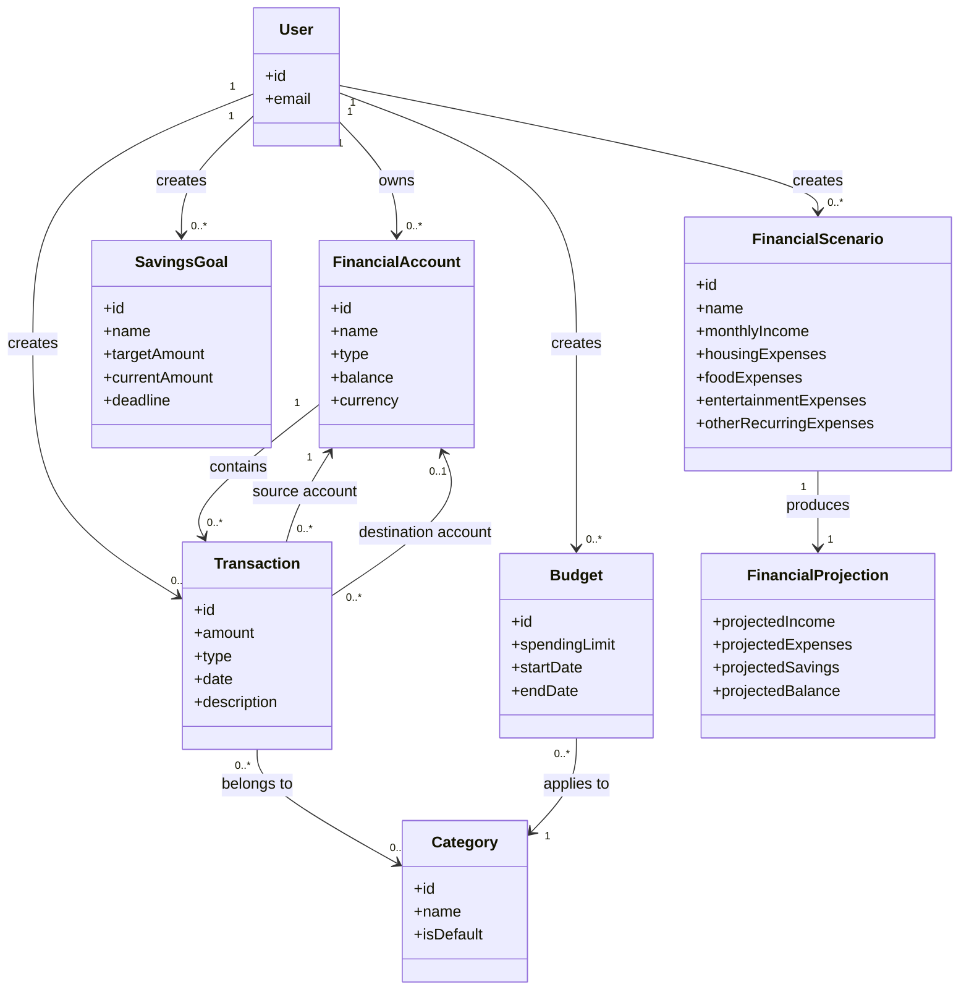

# Domain Model

The Domain Model describes the main concepts of the Personal Finance Manager domain and their relationships. It is based on the functional requirements and glossary.

## Domain Model Diagram

## Main Relationships

* One user can own zero or more financial accounts.
* One user can create zero or more transactions, budgets, savings goals, and financial scenarios.
* A financial account can participate in many transactions.
* A transaction can affect one or two accounts depending on its type.
* A transaction can have zero or one category.
* A category can be assigned to many transactions and budgets.
* Each financial scenario produces one financial projection.
