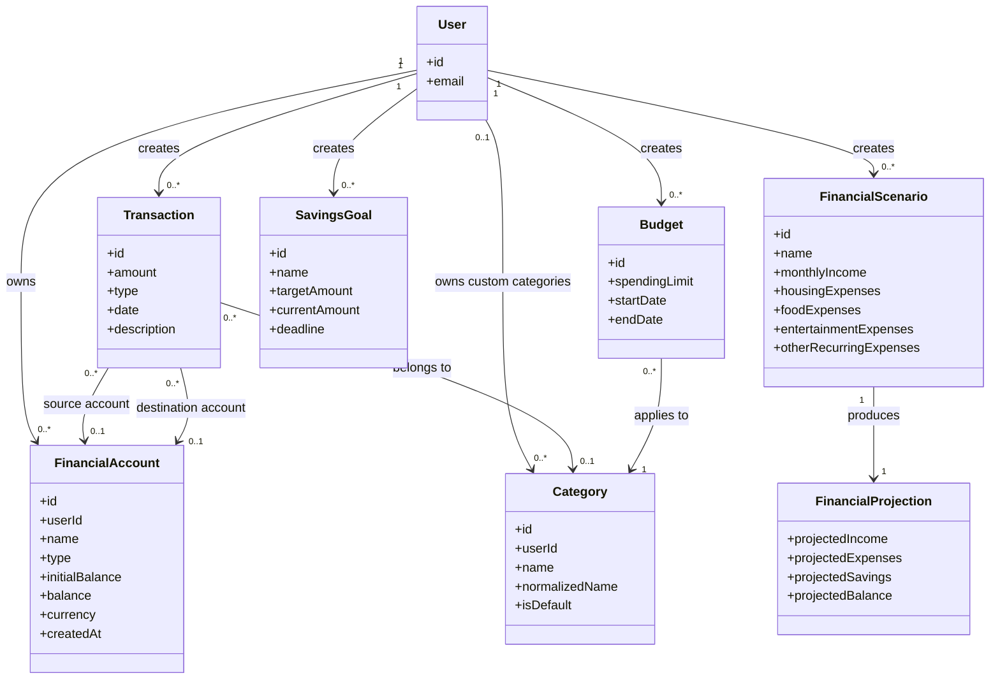

# Domain Model

The Domain Model describes the main concepts of the Personal Finance Manager domain and their relationships. It is based on the functional requirements and glossary.

## Implemented entities

| Model | Current persisted fields |
| --- | --- |
| User | `Id` (int), `Email`, `PasswordHash`, `CreatedAt` |
| FinancialAccount | `Id` (int), `UserId` (int), `Name`, `Type`, `InitialBalance`, `Balance`, `Currency`, `CreatedAt` |
| Category | `Id` (int), `UserId` (nullable int), `Name`, `NormalizedName`, `IsDefault` |

Accounts and custom categories belong to a user; default categories have no owner.
Transaction, Budget, SavingsGoal, FinancialScenario, and FinancialProjection below
are **planned concepts**, not existing backend classes. The diagram is the target
domain model, not the current database schema. See [Database Design](database.md).

## Target Domain Model Diagram

## Target Relationships

* One user can own zero or more financial accounts.
* One user can create zero or more transactions, budgets, savings goals, and financial scenarios.
* A financial account can participate in many transactions.
* A transaction can affect one or two accounts depending on its type.
* A transaction can have zero or one category.
* A category can be assigned to many transactions and budgets.
* Each financial scenario produces one financial projection.
