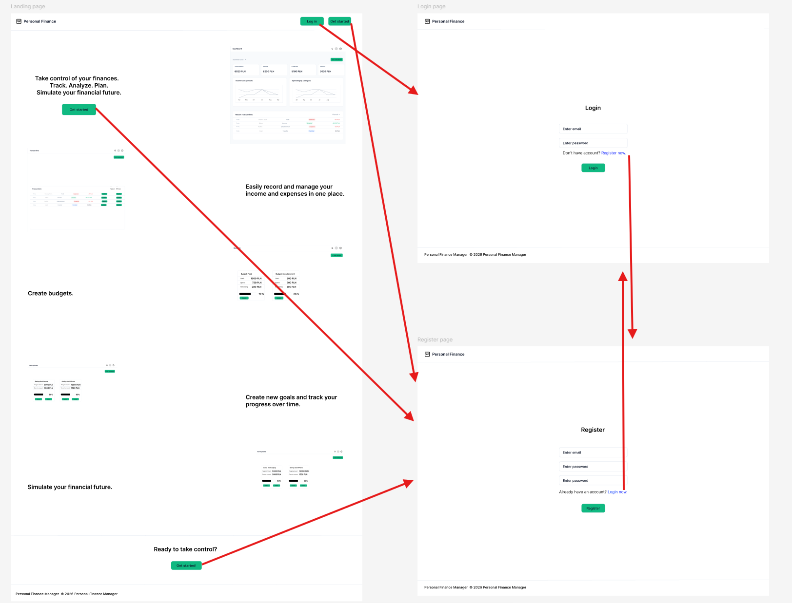
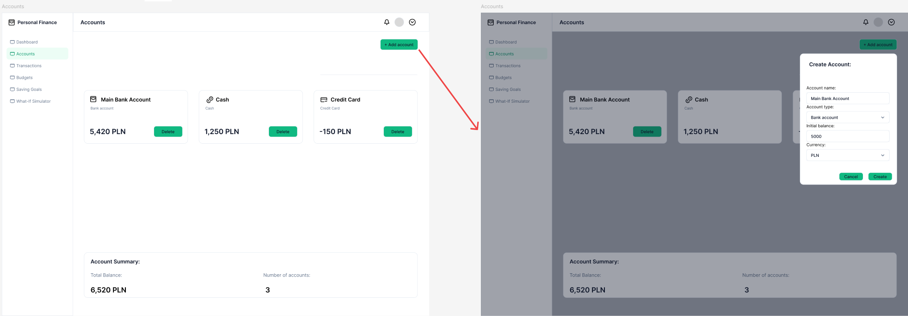

# Scenarios

## UC-01 — Register account

**Main scenario:**

1. The user opens the registration page.
2. The system displays the registration form.
3. The user enters their email address.
4. The user enters a password.
5. The user confirms the password.
6. The user submits the registration form.
7. The system validates the provided data.
8. The system creates the user account.
9. The system securely stores the user's password.
10. The system confirms successful registration.
11. The system redirects the user to the login page.

**Alternative scenarios:**

* If the email address is already registered, the system informs the user and does not create a new account.
* If the passwords do not match, the system informs the user and asks them to correct the data.
* If the provided data is invalid, the system displays validation errors.

---

## UC-02 — Log in

**Main scenario:**

1. The user opens the login page.
2. The system displays the login form.
3. The user enters their email address.
4. The user enters their password.
5. The user submits the login form.
6. The system verifies the provided credentials.
7. The system authenticates the user.
8. The system generates an authentication token.
9. The system returns the authentication token to the application.
10. The application stores the authentication token.
11. The system redirects the user to the Dashboard.

**Alternative scenarios:**

* If the email address or password is incorrect, the system informs the user that the credentials are invalid.
* If the provided data is invalid, the system displays validation errors.
* If authentication fails, the user remains on the login page.

---

## UC-03 — Log out

**Main scenario:**

1. The authenticated user selects the logout option.
2. The application removes the stored authentication token.
3. The system clears the user's authenticated state.
4. The system redirects the user to the landing page.
5. The user is no longer able to access protected application pages.

**Alternative scenario:**

If the user is already unauthenticated, the system redirects them to the landing page or login page.

---

## UC-04 — Create account

**Preconditions:**

The user is authenticated.
The account creation form is available.
The provided account type and currency are supported by the system.

**Main Success Scenario:**

The user opens the account creation form.
The user enters the account name.
The user selects the account type.
The user enters the initial balance.
The user selects the account currency.
The user submits the form.
The system validates the provided data.
The system creates the new financial account and associates it with the authenticated user.
The system confirms that the account was created successfully.
The new account appears in the user's list of accounts.

**Alternative Scenarios:**

If a required field is missing, the system displays a validation error and the account is not created.
If an entered value is invalid, the system displays a validation error and asks the user to correct the data.
If the account cannot be created due to a system or database error, the system displays an error message and does not create the account.

**Postcondition:**
A new financial account is stored in the system and associated with the authenticated user.

---

## UC-05 — View accounts

**Preconditions:**

The user is authenticated.
The user has access to the Accounts page.

**Main Success Scenario:**

The user opens the Accounts page.
The system identifies the authenticated user.
The system retrieves the user's financial accounts.
The system calculates or retrieves the current balance of each account.
The system displays the user's accounts.
The system displays relevant account information, including account name, type, currency, and current balance.

**Alternative Scenarios:**

If the user has no accounts, the system displays an empty state and provides an option to create an account.
If the accounts cannot be retrieved due to a system or database error, the system displays an error message.

**Postcondition:**
The user's financial accounts and their current information are available on the Accounts page.

---

## UC-06 — Edit account

**Preconditions:**

The user is authenticated.
The selected financial account exists.
The selected account belongs to the authenticated user.

**Main Success Scenario:**

The user opens the Accounts page.
The user selects an account to edit.
The system displays the current account information.
The user modifies one or more account fields.
The user submits the changes.
The system validates the updated data.
The system updates the financial account.
The system confirms that the account was updated successfully.
The updated account information is displayed to the user.

**Alternative Scenarios:**

If a required field is missing or contains invalid data, the system displays a validation error and does not save the changes.
If the selected account does not exist, the system displays an error message.
If the selected account does not belong to the authenticated user, the system denies the operation.
If the update fails due to a system or database error, the system displays an error message and preserves the previous account data.

**Postcondition:**
The selected financial account contains the updated information.

---

UC-07 — Delete account

**Preconditions:**

The user is authenticated.
The selected financial account exists.
The selected account belongs to the authenticated user.

**Main Success Scenario:**

The user opens the Accounts page.
The user selects an account to delete.
The system displays a confirmation request.
The user confirms the deletion.
The system verifies that the account belongs to the authenticated user.
The system checks whether the account can be deleted according to the application's data integrity rules.
The system deletes the account.
The system confirms that the account was deleted successfully.
The account is removed from the user's account list.

**Alternative Scenarios:**

If the user cancels the confirmation, the account remains unchanged.
If the selected account does not exist, the system displays an error message.
If the selected account does not belong to the authenticated user, the system denies the operation.
If the account cannot be deleted because it is referenced by existing financial data, the system informs the user and does not delete the account.
If the deletion fails due to a system or database error, the system displays an error message and preserves the account.

**Postcondition:**
The selected financial account is no longer available to the user, unless the deletion was rejected by the system's data integrity rules.
