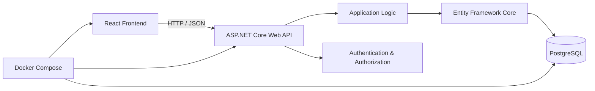

# Technology Stack

## Overview

Personal Finance Manager will be implemented as a web application using a React frontend, ASP.NET Core Web API backend, PostgreSQL database, and Docker for containerization and local development.

The application will follow a client-server architecture:



## Frontend

### React

**React** will be used to build the user interface.

Responsibilities:

* rendering application screens;
* handling user interactions;
* managing client-side state;
* communicating with the backend API;
* displaying financial data, statistics and charts;
* implementing forms for accounts, transactions, budgets and savings goals.

### TypeScript

**TypeScript** will be used instead of plain JavaScript.

Responsibilities:

* providing static typing;
* defining API models and DTO types;
* reducing runtime errors;
* improving maintainability of the frontend codebase.

### Tailwind CSS

**Tailwind CSS** will be used for styling the application.

Responsibilities:

* implementing the UI designed in Figma;
* providing consistent spacing, colors and typography;
* creating responsive layouts;
* reducing the need for custom CSS.

### Frontend API Communication

The frontend will communicate with the ASP.NET Core Web API using HTTP requests and JSON.

The frontend will consume REST API endpoints for:

* authentication;
* accounts;
* transactions;
* categories;
* budgets;
* savings goals;
* dashboard data;
* statistics;
* What-If simulations.

---

## Backend

### C# / ASP.NET Core

**C# with ASP.NET Core Web API** will be used to implement the backend.

Responsibilities:

* exposing REST API endpoints;
* validating incoming requests;
* implementing business logic;
* handling authentication and authorization;
* managing financial operations;
* calculating statistics and financial projections;
* communicating with PostgreSQL.

The backend will be organized into separate application modules such as:

```text
Auth
Accounts
Transactions
Categories
Dashboard
Statistics
Budgets
Savings Goals
What-If Simulator
```

### Entity Framework Core

**Entity Framework Core** will be used as the ORM.

Responsibilities:

* mapping C# domain entities to database tables;
* querying and modifying data;
* managing relationships between entities;
* creating and applying database migrations.

### Npgsql

**Npgsql** will be used as the PostgreSQL provider for Entity Framework Core.

It will provide communication between the ASP.NET Core backend and PostgreSQL database.

### REST API

The backend will expose a RESTful API using JSON.

Example:

```text
GET    /api/accounts
POST   /api/accounts
PUT    /api/accounts/{id}
DELETE /api/accounts/{id}

GET    /api/transactions
POST   /api/transactions
PUT    /api/transactions/{id}
DELETE /api/transactions/{id}

GET    /api/budgets
POST   /api/budgets

GET    /api/savings-goals
POST   /api/savings-goals

POST   /api/simulations
POST   /api/simulations/{id}/run
```

---

## Database

### PostgreSQL

**PostgreSQL** will be used as the primary relational database.

It will store persistent application data such as:

* users;
* financial accounts;
* transactions;
* categories;
* budgets;
* savings goals;
* What-If scenarios.

The database will use relational constraints and foreign keys to maintain data integrity.

Financial amounts will be stored using an appropriate decimal type rather than floating-point values.

---

## Containerization

### Docker

**Docker** will be used to containerize the application components and provide a consistent development environment.

The main containers will be:

```text
React Frontend
      │
      ▼
ASP.NET Core API
      │
      ▼
PostgreSQL
```

### Docker Compose

**Docker Compose** will be used to run the application services together during local development.

The Compose environment will contain:

```text
frontend
backend
postgres
```

This will allow the entire application to be started using a single command.

---

## Development and API Tools

### Git

**Git** will be used for version control.

### GitHub

**GitHub** will be used for:

* source code hosting;
* issue tracking;
* project planning;
* pull requests;
* documenting development progress.

### Swagger / OpenAPI

**Swagger / OpenAPI** will be used to document and test the backend API during development.

It will provide an interactive interface for inspecting available endpoints, request models and responses.

---

## Testing

Testing will be introduced at both backend and frontend levels.

### Backend

The backend will contain:

* unit tests for business logic;
* integration tests for API and database-related functionality.

### Frontend

The frontend will contain tests for important UI logic and components where appropriate.

---

## Technology Summary

| Area                | Technology                | Purpose                            |
| ------------------- | ------------------------- | ---------------------------------- |
| Frontend            | React                     | User interface                     |
| Frontend language   | TypeScript                | Static typing                      |
| Styling             | Tailwind CSS              | UI styling and responsive layout   |
| Backend             | C# / ASP.NET Core Web API | REST API and business logic        |
| ORM                 | Entity Framework Core     | Database access                    |
| PostgreSQL provider | Npgsql                    | EF Core ↔ PostgreSQL communication |
| Database            | PostgreSQL                | Persistent data storage            |
| Containerization    | Docker                    | Application containers             |
| Local orchestration | Docker Compose            | Running application services       |
| API documentation   | Swagger / OpenAPI         | API documentation and testing      |
| Version control     | Git                       | Source control                     |
| Project management  | GitHub Issues / Projects  | Development planning and tracking  |
| UI design           | Figma                     | Interface design and prototyping   |
