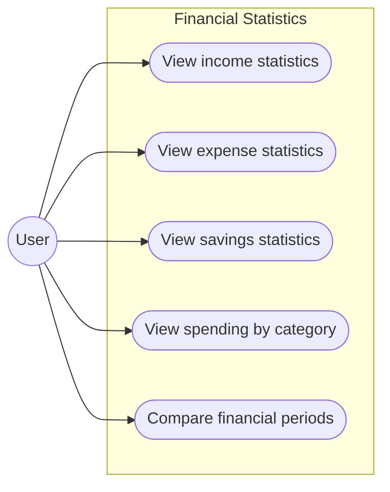
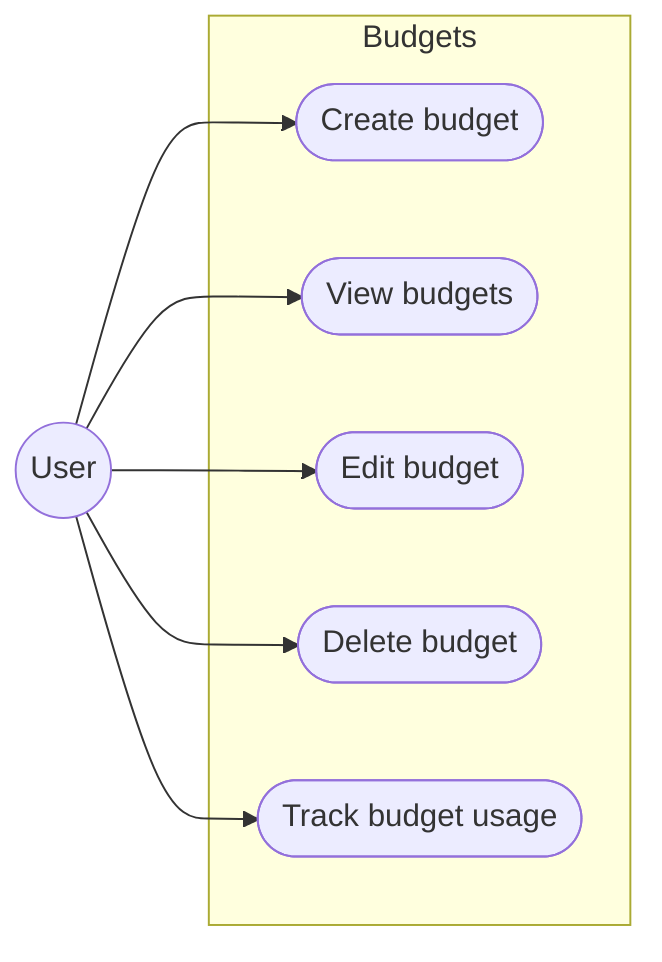

# Use Cases

This catalog includes planned product behavior. Authentication and accounts are
implemented with the limitations in [Backend Status](backend-status.md).
UC-14–UC-17 have backend category endpoints; category assignment and the transaction,
budget, statistics, savings-goal, and simulation use cases await their backend
modules. UI diagrams do not imply an available API.

## 1. Authentication

### UC-01 — [Register account](functional-requirements.md#fr-011)

The user creates a new account by providing an email address and password. The system validates the provided data, creates the user account, and securely stores the password.

### UC-02 — [Log in](functional-requirements.md#fr-021)

The user logs in by providing their email address and password. The system verifies the credentials and, if they are valid, authenticates the user and provides an authentication token.

### UC-03 — [Log out](functional-requirements.md#fr-024)

The authenticated user logs out of the application. The frontend removes the
stored JWT and clears its local authentication state. There is no backend logout
endpoint or token revocation; the issued token remains valid until its expiry
under the token validator's lifetime rules.

## 2. Financial Accounts

### UC-04 — [Create account](functional-requirements.md#fr-031)

The user creates a new financial account that will be used to record and manage their financial transactions. The user provides the account naрme, account type, initial balance, and currency. The system validates the provided data and creates the account associated with the authenticated user.

### UC-05 — [View accounts](functional-requirements.md#fr-035)

The user views their financial accounts and their current financial information. The system retrieves the accounts belonging to the authenticated user and displays their relevant details.

### UC-06 — [Edit account](functional-requirements.md#fr-033)

The user modifies the information of an existing financial account. The system validates the updated data and saves the changes while preserving the account's ownership and financial integrity.

### UC-07 — [Delete account](functional-requirements.md#fr-034)

The user deletes an existing financial account from their account list. The system verifies that the account belongs to the authenticated user and performs the deletion according to the application's financial data integrity rules.

---

## 3. Transactions

### UC-08 — [Add transaction](functional-requirements.md#fr-041)

### UC-09 — [View transactions](functional-requirements.md#fr-043)

### UC-10 — [Edit transaction](functional-requirements.md#fr-044)

### UC-11 — [Delete transaction](functional-requirements.md#fr-045)

### UC-12 — [Filter transactions](functional-requirements.md#fr-047)

### UC-13 — [Sort transactions](functional-requirements.md#fr-048)

---

## 4. Categories

### UC-14 — [Create category](functional-requirements.md#fr-052)

### UC-15 — [View categories](functional-requirements.md#fr-051)

### UC-16 — [Edit category](functional-requirements.md#fr-053)

### UC-17 — [Delete category](functional-requirements.md#fr-054)

### UC-18 — [Assign category to transaction](functional-requirements.md#fr-055)

---

## 5. Dashboard

### UC-19 — [View dashboard](functional-requirements.md#fr-061)

### UC-20 — [Select analysis period](functional-requirements.md#fr-062)

---

## 6. Financial Statistics

### UC-21 — [View income statistics](functional-requirements.md#fr-071)

### UC-22 — [View expense statistics](functional-requirements.md#fr-072)

### UC-23 — [View savings statistics](functional-requirements.md#fr-073)

### UC-24 — [View spending by category](functional-requirements.md#fr-074)

### UC-25 — [Compare financial periods](functional-requirements.md#fr-075)

---

## 7. Budgets

### UC-26 — [Create budget](functional-requirements.md#fr-081)

### UC-27 — [View budgets](functional-requirements.md#fr-082)

### UC-28 — [Edit budget](functional-requirements.md#fr-086)

### UC-29 — [Delete budget](functional-requirements.md#fr-087)

### UC-30 — [Track budget usage](functional-requirements.md#fr-082)

---

## 8. Savings Goals

### UC-31 — [Create savings goal](functional-requirements.md#fr-091)

### UC-32 — [View savings goals](functional-requirements.md#fr-092)

### UC-33 — [Edit savings goal](functional-requirements.md#fr-096)

### UC-34 — [Delete savings goal](functional-requirements.md#fr-097)

### UC-35 — [Track goal progress](functional-requirements.md#fr-092)

### UC-36 — [Estimate goal achievability](functional-requirements.md#fr-095)

---

## 9. Financial What-If Simulator

### UC-37 — [Create financial scenario](functional-requirements.md#fr-101)

### UC-38 — [Modify scenario parameters](functional-requirements.md#fr-102)

### UC-39 — [Run financial simulation](functional-requirements.md#fr-103)

### UC-40 — [View financial projection](functional-requirements.md#fr-104)

### UC-41 — [Compare scenario with current situation](functional-requirements.md#fr-107)

### UC-42 — [Analyze impact on savings goals](functional-requirements.md#fr-105)

### UC-43 — [Analyze impact on budgets](functional-requirements.md#fr-106)

### UC-44 — [Reset scenario](functional-requirements.md#fr-109)
