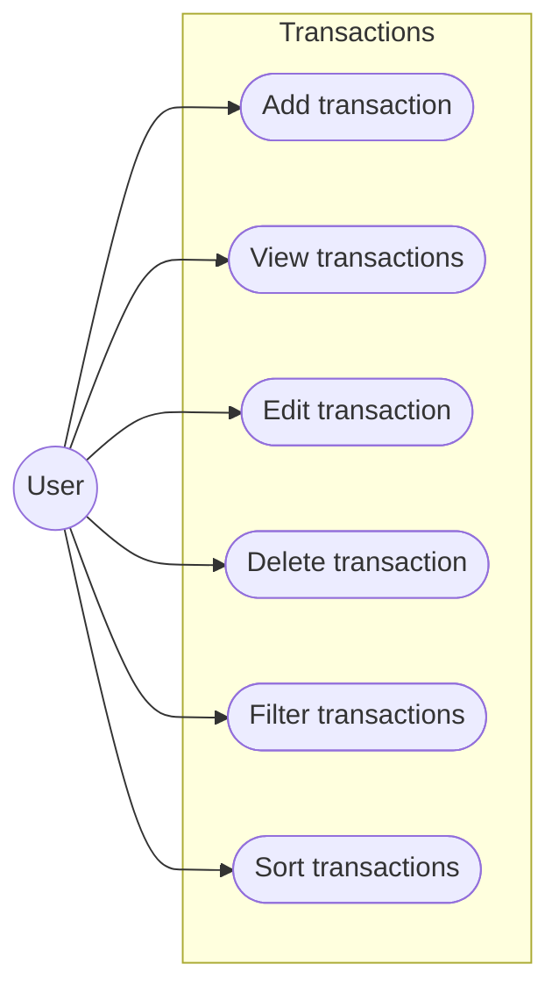
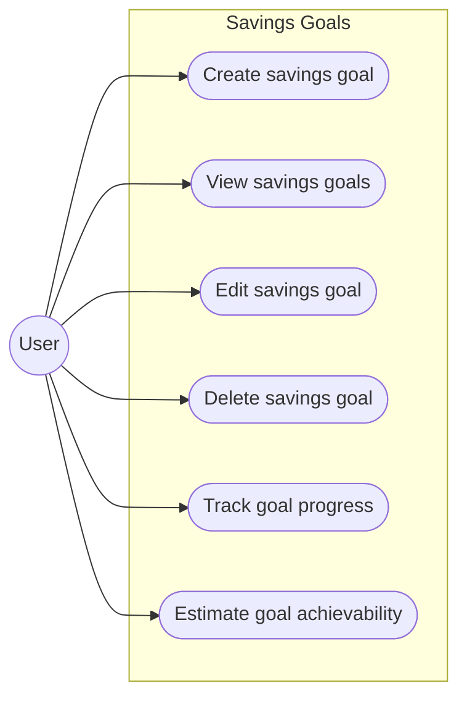
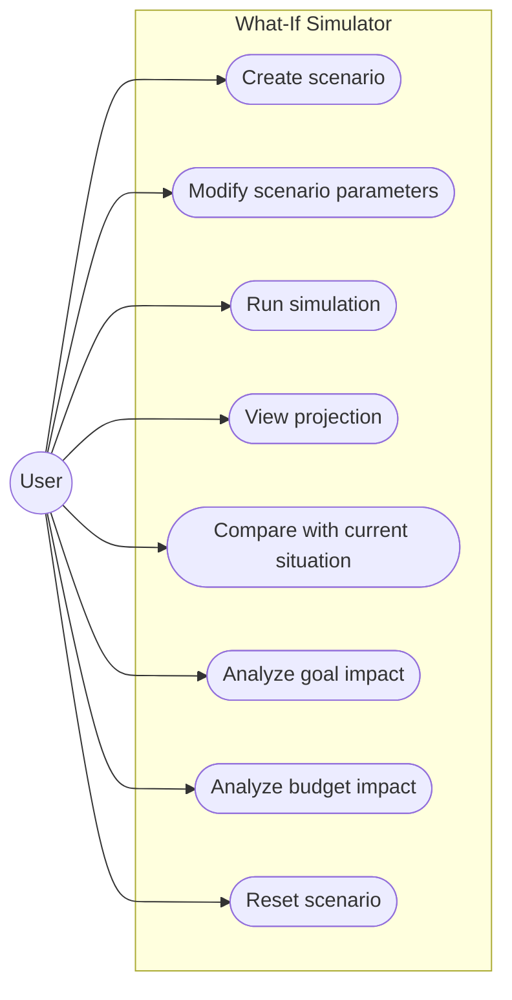

# Use Cases

## 1. Authentication

* **UC-01** - Register account
* **UC-02** - Log in
* **UC-03** - Log out

---

## 2. Financial Accounts

* **UC-04** - Create account
* **UC-05** - View accounts
* **UC-06** - Edit account
* **UC-07** - Delete account

---

## 3. Transactions

* **UC-08** - Add transaction
* **UC-09** - View transactions
* **UC-10** - Edit transaction
* **UC-11** - Delete transaction
* **UC-12** - Filter transactions
* **UC-13** - Sort transactions

---

## 4. Categories

* **UC-14** - Create category
* **UC-15** - View categories
* **UC-16** - Edit category
* **UC-17** - Delete category
* **UC-18** - Assign category to transaction

---

## 5. Dashboard

* **UC-19** - View dashboard
* **UC-20** - Select analysis period

---

## 6. Financial Statistics

* **UC-21** - View income statistics
* **UC-22** - View expense statistics
* **UC-23** - View savings statistics
* **UC-24** - View spending by category
* **UC-25** - Compare financial periods

---

## 7. Budgets

* **UC-26** - Create budget
* **UC-27** - View budgets
* **UC-28** - Edit budget
* **UC-29** - Delete budget
* **UC-30** - Track budget usage

---

## 8. Savings Goals

* **UC-31** - Create savings goal
* **UC-32** - View savings goals
* **UC-33** - Edit savings goal
* **UC-34** - Delete savings goal
* **UC-35** - Track goal progress
* **UC-36** - Estimate goal achievability

---

## 9. Financial What-If Simulator

* **UC-37** - Create financial scenario
* **UC-38** - Modify scenario parameters
* **UC-39** - Run financial simulation
* **UC-40** - View financial projection
* **UC-41** - Compare scenario with current situation
* **UC-42** - Analyze impact on savings goals
* **UC-43** - Analyze impact on budgets
* **UC-44** - Reset scenario
