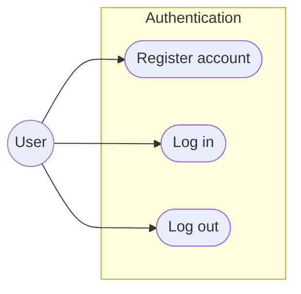
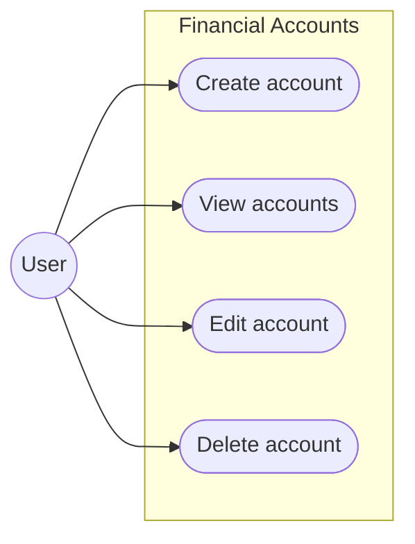
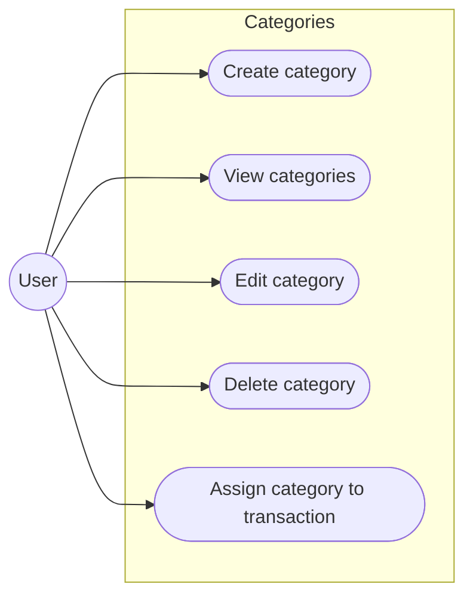
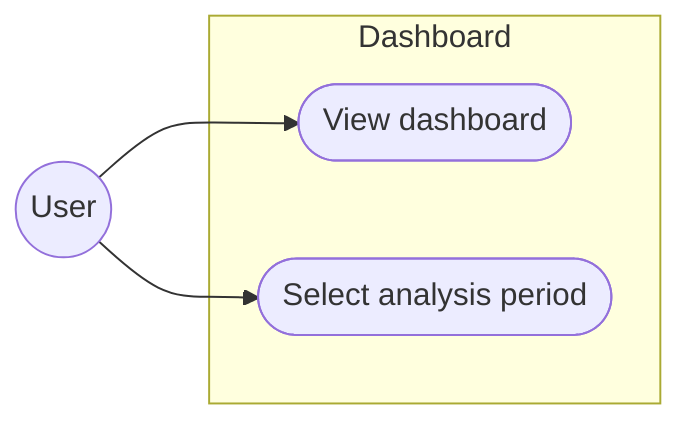

# Use Cases

## 1. Authentication

* **[UC-01](functional-requirements.md#L9)** - [Register account](functional-requirements.md#L9)
* **[UC-02](functional-requirements.md#L25)** - [Log in](functional-requirements.md#L25)
* **[UC-03](functional-requirements.md#L31)** - [Log out](functional-requirements.md#L31)

---

## 2. Financial Accounts

* **[UC-04](functional-requirements.md#L39)** - [Create account](functional-requirements.md#L39)
* **[UC-05](functional-requirements.md#L52)** - [View accounts](functional-requirements.md#L52)
* **[UC-06](functional-requirements.md#L48)** - [Edit account](functional-requirements.md#L48)
* **[UC-07](functional-requirements.md#L50)** - [Delete account](functional-requirements.md#L50)

---

## 3. Transactions

* **[UC-08](functional-requirements.md#L71)** - [Add transaction](functional-requirements.md#L71)
* **[UC-09](functional-requirements.md#L84)** - [View transactions](functional-requirements.md#L84)
* **[UC-10](functional-requirements.md#L86)** - [Edit transaction](functional-requirements.md#L86)
* **[UC-11](functional-requirements.md#L88)** - [Delete transaction](functional-requirements.md#L88)
* **[UC-12](functional-requirements.md#L92)** - [Filter transactions](functional-requirements.md#L92)
* **[UC-13](functional-requirements.md#L99)** - [Sort transactions](functional-requirements.md#L99)

---

## 4. Categories

* **[UC-14](functional-requirements.md#L121)** - [Create category](functional-requirements.md#L121)
* **[UC-15](functional-requirements.md#L119)** - [View categories](functional-requirements.md#L119)
* **[UC-16](functional-requirements.md#L123)** - [Edit category](functional-requirements.md#L123)
* **[UC-17](functional-requirements.md#L125)** - [Delete category](functional-requirements.md#L125)
* **[UC-18](functional-requirements.md#L127)** - [Assign category to transaction](functional-requirements.md#L127)

---

## 5. Dashboard

* **[UC-19](functional-requirements.md#L133)** - [View dashboard](functional-requirements.md#L133)
* **[UC-20](functional-requirements.md#L145)** - [Select analysis period](functional-requirements.md#L145)

---

## 6. Financial Statistics

* **[UC-21](functional-requirements.md#L159)** - [View income statistics](functional-requirements.md#L159)
* **[UC-22](functional-requirements.md#L161)** - [View expense statistics](functional-requirements.md#L161)
* **[UC-23](functional-requirements.md#L163)** - [View savings statistics](functional-requirements.md#L163)
* **[UC-24](functional-requirements.md#L169)** - [View spending by category](functional-requirements.md#L169)
* **[UC-25](functional-requirements.md#L171)** - [Compare financial periods](functional-requirements.md#L171)

---

## 7. Budgets

* **[UC-26](functional-requirements.md#L179)** - [Create budget](functional-requirements.md#L179)
* **[UC-27](functional-requirements.md#L188)** - [View budgets](functional-requirements.md#L188)
* **[UC-28](functional-requirements.md#L196)** - [Edit budget](functional-requirements.md#L196)
* **[UC-29](functional-requirements.md#L198)** - [Delete budget](functional-requirements.md#L198)
* **[UC-30](functional-requirements.md#L188)** - [Track budget usage](functional-requirements.md#L188)

---

## 8. Savings Goals

* **[UC-31](functional-requirements.md#L204)** - [Create savings goal](functional-requirements.md#L204)
* **[UC-32](functional-requirements.md#L213)** - [View savings goals](functional-requirements.md#L213)
* **[UC-33](functional-requirements.md#L221)** - [Edit savings goal](functional-requirements.md#L221)
* **[UC-34](functional-requirements.md#L223)** - [Delete savings goal](functional-requirements.md#L223)
* **[UC-35](functional-requirements.md#L213)** - [Track goal progress](functional-requirements.md#L213)
* **[UC-36](functional-requirements.md#L219)** - [Estimate goal achievability](functional-requirements.md#L219)

---

## 9. Financial What-If Simulator

* **[UC-37](functional-requirements.md#L231)** - [Create financial scenario](functional-requirements.md#L231)
* **[UC-38](functional-requirements.md#L233)** - [Modify scenario parameters](functional-requirements.md#L233)
* **[UC-39](functional-requirements.md#L241)** - [Run financial simulation](functional-requirements.md#L241)
* **[UC-40](functional-requirements.md#L243)** - [View financial projection](functional-requirements.md#L243)
* **[UC-41](functional-requirements.md#L249)** - [Compare scenario with current situation](functional-requirements.md#L249)
* **[UC-42](functional-requirements.md#L245)** - [Analyze impact on savings goals](functional-requirements.md#L245)
* **[UC-43](functional-requirements.md#L247)** - [Analyze impact on budgets](functional-requirements.md#L247)
* **[UC-44](functional-requirements.md#L253)** - [Reset scenario](functional-requirements.md#L253)
