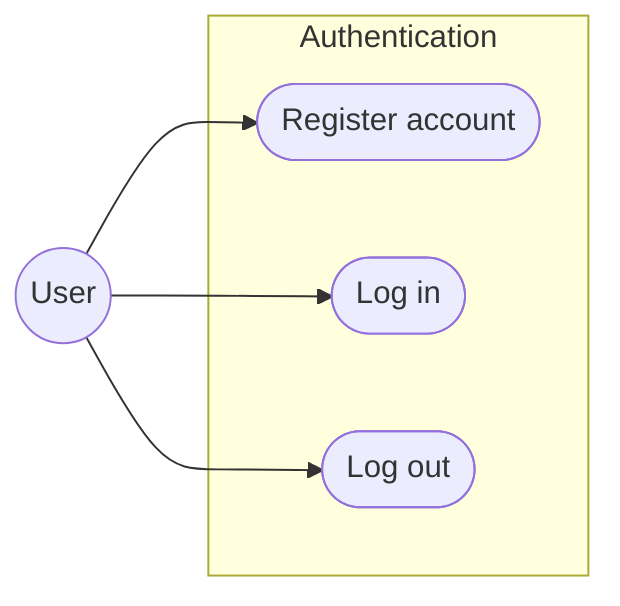
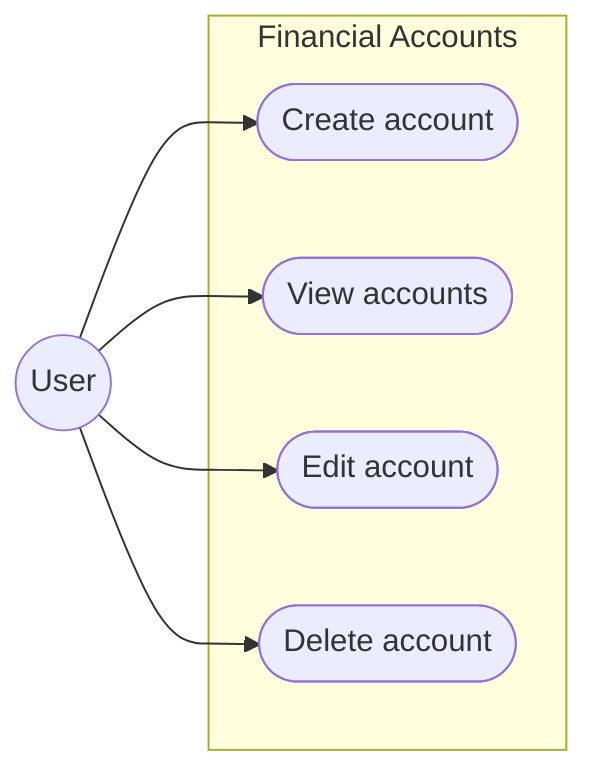
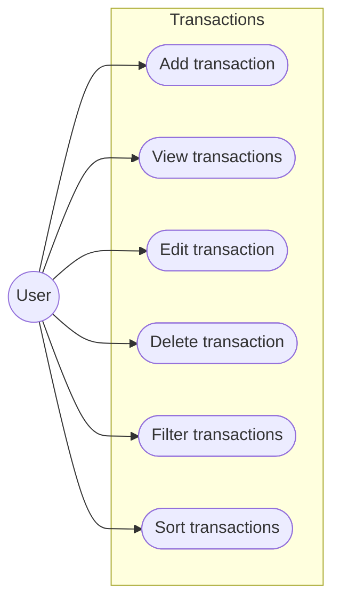
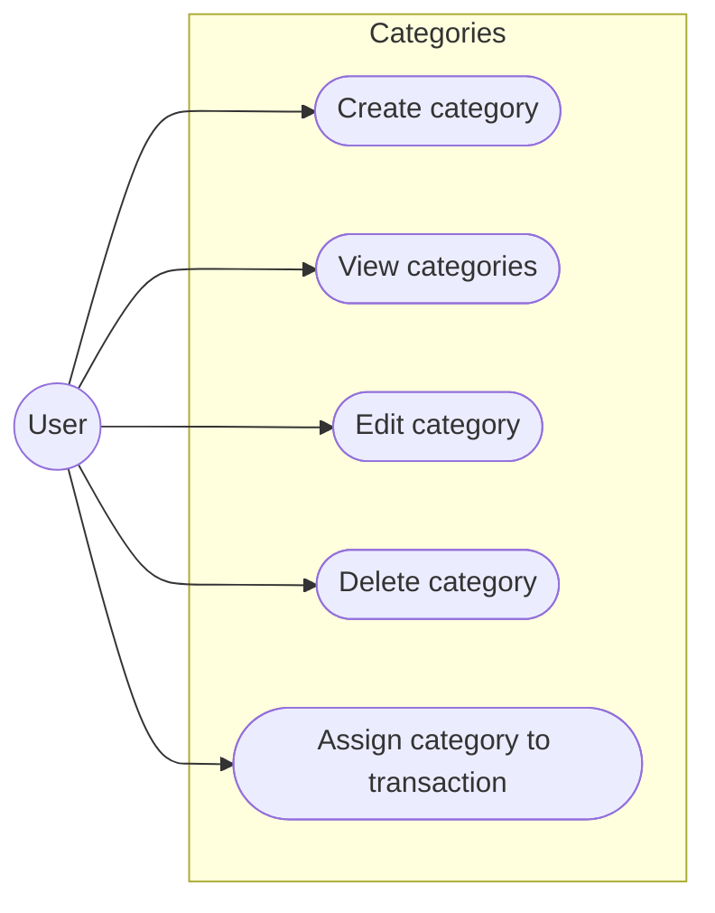
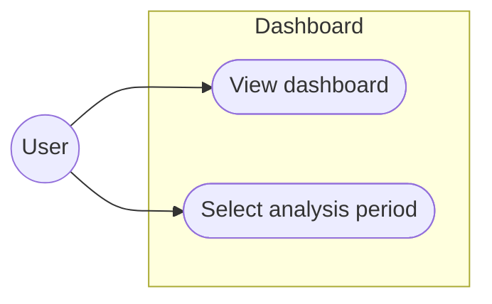
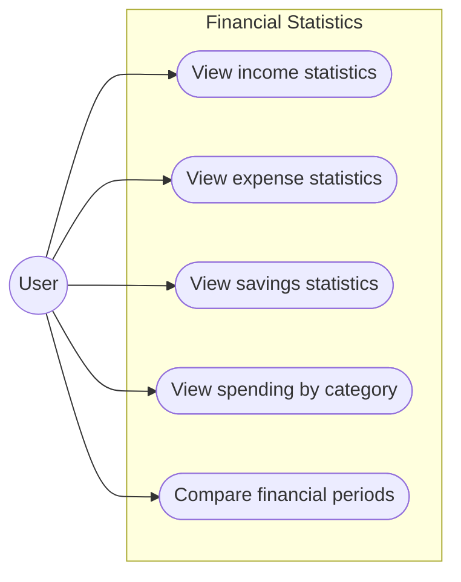
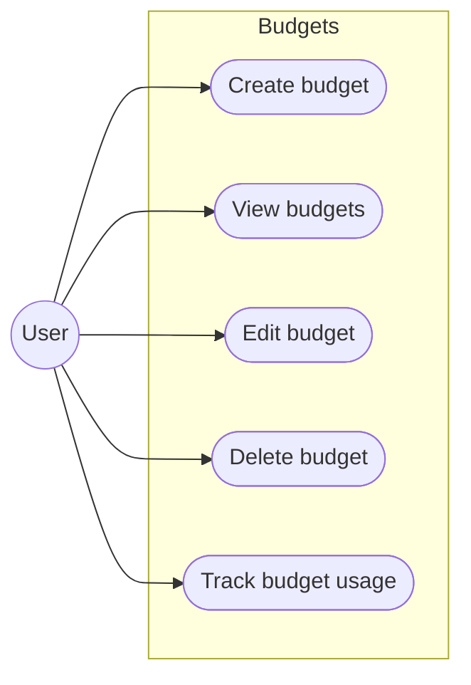
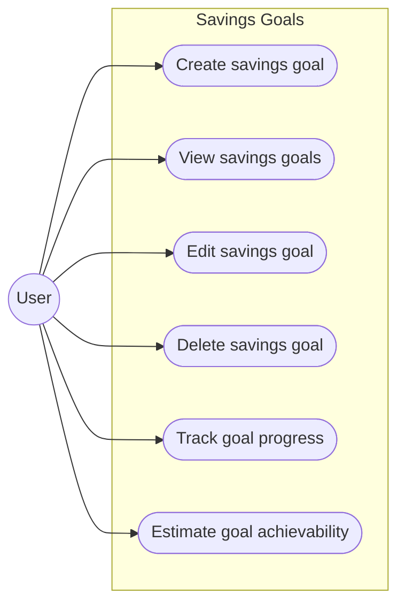
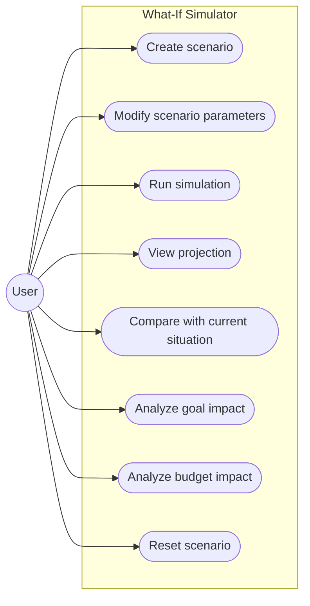
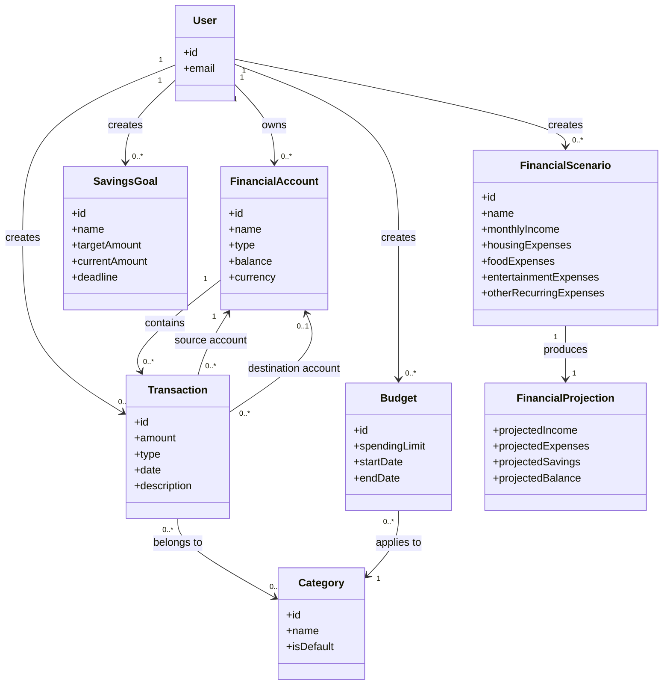

# Personal Finance Manager requirments

Personal Finance Manager is a web application that allows users to track their income and expenses, analyze their financial habits, set financial goals and budgets, and simulate future financial scenarios to understand how different decisions may affect their financial situation.

# Functional Requirements

## 1. Authentication

### FR-01 — User Registration

**FR-01.1** The system shall allow a user to create an account.

The user shall provide:

* Email address
* Password
* Password confirmation

**FR-01.2** The system shall verify that the provided email address is not already registered.

**FR-01.3** The system shall validate the password according to the application's password requirements.

**FR-01.4** After successful registration, the user shall be able to authenticate and access the application.

### FR-02 — User Authentication

**FR-02.1** The system shall allow users to authenticate using their email address and password.

**FR-02.2** The system shall create an authenticated session after successful authentication.

**FR-02.3** The system shall reject invalid authentication credentials.

**FR-02.4** The system shall allow authenticated users to log out.

**FR-02.5** Users shall only have access to their own financial data.

---

## 2. Financial Accounts

**FR-03.1** The system shall allow users to create financial accounts.

**FR-03.2** When creating an account, the user shall specify:

* Account name
* Account type
* Initial balance
* Currency

**FR-03.3** The system shall allow users to edit their financial accounts.

**FR-03.4** The system shall allow users to delete their financial accounts.

**FR-03.5** The system shall display the current balance of each account.

The system shall support different account types, including:

* Cash
* Bank account
* Credit card
* Savings account

---

## 3. Transactions

A transaction shall have one of the following types:

* Income
* Expense
* Transfer

**FR-04.1** The system shall allow users to create transactions.

When creating a transaction, the user shall be able to specify:

* Amount
* Transaction type
* Category
* Account
* Date
* Description

**FR-04.2** The system shall persist transactions in the database.

**FR-04.3** The system shall allow users to view their transactions.

**FR-04.4** The system shall allow users to edit existing transactions.

**FR-04.5** The system shall allow users to delete transactions.

**FR-04.6** The system shall automatically update the affected account balance when a transaction is created, modified, or deleted.

**FR-04.7** The system shall allow users to filter transactions by:

* Date
* Category
* Transaction type
* Account

**FR-04.8** The system shall allow users to sort transactions by date and amount.

---

## 4. Categories

The system shall provide predefined categories for organizing transactions.

Default categories shall include:

* Food
* Transport
* Housing
* Entertainment
* Shopping
* Health
* Education
* Subscriptions
* Other

**FR-05.1** The system shall provide predefined transaction categories.

**FR-05.2** The system shall allow users to create custom categories.

**FR-05.3** The system shall allow users to rename their custom categories.

**FR-05.4** The system shall allow users to delete their custom categories.

**FR-05.5** The system shall allow users to assign a category to a transaction.

---

## 5. Dashboard

**FR-06.1** The system shall provide a dashboard containing an overview of the user's financial situation.

The dashboard shall display:

* Current total balance
* Income for the selected period
* Expenses for the selected period
* Savings for the selected period
* Recent transactions
* Spending by category
* Income versus expenses

**FR-06.2** The system shall allow users to select the period used for dashboard calculations.

Supported periods shall include:

* This week
* This month
* Last month
* Last three months
* Custom period

---

## 6. Financial Statistics

**FR-07.1** The system shall calculate the total income for a selected period.

**FR-07.2** The system shall calculate the total expenses for a selected period.

**FR-07.3** The system shall calculate savings for a selected period.

```text
Savings = Income - Expenses
```

**FR-07.4** The system shall provide a breakdown of expenses by category.

**FR-07.5** The system shall allow users to compare financial statistics between different periods.

The system shall provide information about changes in spending between periods.

---

## 7. Budgets

**FR-08.1** The system shall allow users to create budgets for specific categories and periods.

A budget shall contain:

* Category
* Spending limit
* Start date
* End date

**FR-08.2** The system shall calculate the amount spent within a budget.

**FR-08.3** The system shall display the remaining amount available within a budget.

**FR-08.4** The system shall display the percentage of the budget that has been used.

**FR-08.5** The system shall indicate when spending exceeds the configured budget.

**FR-08.6** The system shall allow users to edit existing budgets.

**FR-08.7** The system shall allow users to delete existing budgets.

---

## 8. Savings Goals

**FR-09.1** The system shall allow users to create financial savings goals.

A savings goal shall contain:

* Name
* Target amount
* Current amount
* Deadline

**FR-09.2** The system shall display the user's progress towards each savings goal.

**FR-09.3** The system shall calculate the remaining amount required to reach a savings goal.

**FR-09.4** The system shall calculate the average amount that needs to be saved per month to reach the goal by its deadline.

**FR-09.5** The system shall estimate whether a savings goal is achievable based on the user's financial data.

**FR-09.6** The system shall allow users to edit existing savings goals.

**FR-09.7** The system shall allow users to delete existing savings goals.

---

## 9. Financial What-If Simulator

The Financial What-If Simulator shall allow users to create hypothetical financial scenarios without modifying their actual financial data.

**FR-10.1** The system shall allow users to create hypothetical financial scenarios.

**FR-10.2** A scenario shall allow users to modify selected financial parameters, including:

* Monthly income
* Housing expenses
* Food expenses
* Entertainment expenses
* Other recurring expenses

**FR-10.3** The system shall calculate the projected monthly income, expenses, and savings based on the scenario.

**FR-10.4** The system shall calculate the projected account balance based on the scenario.

**FR-10.5** The system shall calculate the impact of a hypothetical scenario on the user's savings goals.

**FR-10.6** The system shall calculate the impact of a hypothetical scenario on the user's budgets.

**FR-10.7** The system shall allow users to compare their current financial situation with a hypothetical scenario.

**FR-10.8** Hypothetical scenarios shall not modify the user's actual transactions, accounts, budgets, or savings goals.

**FR-10.9** The system shall allow users to modify or reset scenario parameters before applying the simulation.

---

# Future Features

The following features are not part of the initial MVP and may be implemented in future versions.

## 10. Financial Health Score

The system may provide a financial health score representing the user's overall financial situation.

Potential factors may include:

* Savings behavior
* Budget management
* Spending patterns
* Financial consistency

The system may:

* Calculate a financial health score
* Display factors contributing to the score
* Track changes in the score over time

---

## 11. Financial Insights

The system may generate automatically generated insights based on the user's financial data.

Examples include:

* Significant changes in spending
* Unusual spending patterns
* Changes in monthly savings
* Increased spending in specific categories

The system may provide human-readable explanations of identified financial patterns.

---

## 12. Recurring Transactions

The system may support recurring transactions such as:

* Rent
* Subscriptions
* Regular income
* Utility payments

A recurring transaction may contain:

* Amount
* Category
* Account
* Frequency
* Start date
* Optional end date

The system may automatically create transactions according to the configured recurrence schedule.

---

## 13. Transaction Search

The system may allow users to search their transactions using text.

Search results may include transactions whose descriptions or other searchable fields match the provided query.

---

## 14. Data Export

The system may allow users to export their financial data.

Potential export functionality:

* Export transactions
* Select the export period
* Export data in CSV format

---

## 15. AI Financial Assistant

The system may provide an AI-powered financial assistant capable of answering questions based on the user's financial data.

Potential examples:

* "Can I afford a 1500 PLN purchase this month?"
* "Why did my expenses increase this month?"
* "How can I reach my savings goal faster?"
* "What would happen if I reduced my food expenses by 200 PLN?"

The AI assistant should use the application's financial data and calculations rather than generating financial information independently.

---

# Non-Functional Requirements

## 1. Security

**NFR-01.1** The system shall store user passwords using a secure one-way password hashing algorithm.

**NFR-01.2** The system shall require authentication before allowing access to protected financial data and operations.

**NFR-01.3** The system shall ensure that a user cannot access or modify another user's financial data.

**NFR-01.4** The system shall validate user input to prevent common security vulnerabilities.

---

## 2. Data Integrity

**NFR-02.1** The system shall maintain consistency between transactions and account balances.

**NFR-02.2** Financial operations that modify multiple related data records shall be performed atomically.

**NFR-02.3** The system shall prevent invalid financial data from being persisted.

**NFR-02.4** Monetary values shall be represented and calculated using a numeric type that prevents floating-point precision errors.

---

## 3. Privacy

**NFR-03.1** The system shall not expose sensitive financial or authentication data through API responses, logs, or error messages.

**NFR-03.2** The system shall collect only personal information that is necessary for the application's functionality.

---

## 4. Performance

**NFR-04.1** Typical API requests should be processed within 500 ms under normal operating conditions.

**NFR-04.2** The dashboard should become usable within 2 seconds under normal operating conditions.

**NFR-04.3** The system shall use pagination when retrieving large collections of transactions.

---

## 5. Reliability

**NFR-05.1** The system shall preserve all persisted financial data after application restarts.

**NFR-05.2** A failed financial operation shall not leave the system in an inconsistent state.

---

## 6. Maintainability

**NFR-06.1** The application shall use a modular architecture with clearly separated responsibilities.

**NFR-06.2** Business logic shall be separated from presentation and infrastructure concerns.

**NFR-06.3** The backend API shall be documented using the OpenAPI specification.

**NFR-06.4** The codebase shall follow consistent coding conventions.

---

## 7. Usability

**NFR-07.1** The application shall provide clear validation and error messages to users.

**NFR-07.2** The application shall use a consistent user interface across its main sections.

**NFR-07.3** The What-If Simulator shall clearly distinguish hypothetical scenarios from actual financial data.

---

## 8. Testability

**NFR-08.1** The backend shall be designed so that its business logic can be tested independently from external infrastructure.

**NFR-08.2** Critical financial calculations shall be covered by automated tests.

**NFR-08.3** The What-If Simulator shall have automated tests covering different financial scenarios.

---

## 9. Compatibility

**NFR-09.1** The web application shall support current versions of major desktop browsers.

**NFR-09.2** The user interface shall be responsive and usable on desktop and mobile screen sizes.

---

## 10. Observability

**NFR-10.1** The backend shall provide structured application logs.

**NFR-10.2** The application shall provide health checks for critical infrastructure components.

---

# Use Cases

## 1. Authentication

### Use Case Diagram



### Use Cases

* **UC-01** — Register account
* **UC-02** — Log in
* **UC-03** — Log out

---

## 2. Financial Accounts

### Use Case Diagram



### Use Cases

* **UC-04** — Create account
* **UC-05** — View accounts
* **UC-06** — Edit account
* **UC-07** — Delete account

---

## 3. Transactions

### Use Case Diagram



### Use Cases

* **UC-08** — Add transaction
* **UC-09** — View transactions
* **UC-10** — Edit transaction
* **UC-11** — Delete transaction
* **UC-12** — Filter transactions
* **UC-13** — Sort transactions

---

## 4. Categories

### Use Case Diagram



### Use Cases

* **UC-14** — Create category
* **UC-15** — View categories
* **UC-16** — Edit category
* **UC-17** — Delete category
* **UC-18** — Assign category to transaction

---

## 5. Dashboard

### Use Case Diagram



### Use Cases

* **UC-19** — View dashboard
* **UC-20** — Select analysis period

---

## 6. Financial Statistics

### Use Case Diagram



### Use Cases

* **UC-21** — View income statistics
* **UC-22** — View expense statistics
* **UC-23** — View savings statistics
* **UC-24** — View spending by category
* **UC-25** — Compare financial periods

---

## 7. Budgets

### Use Case Diagram



### Use Cases

* **UC-26** — Create budget
* **UC-27** — View budgets
* **UC-28** — Edit budget
* **UC-29** — Delete budget
* **UC-30** — Track budget usage

---

## 8. Savings Goals

### Use Case Diagram



### Use Cases

* **UC-31** — Create savings goal
* **UC-32** — View savings goals
* **UC-33** — Edit savings goal
* **UC-34** — Delete savings goal
* **UC-35** — Track goal progress
* **UC-36** — Estimate goal achievability

---

## 9. Financial What-If Simulator

### Use Case Diagram



### Use Cases

* **UC-37** — Create financial scenario
* **UC-38** — Modify scenario parameters
* **UC-39** — Run financial simulation
* **UC-40** — View financial projection
* **UC-41** — Compare scenario with current situation
* **UC-42** — Analyze impact on savings goals
* **UC-43** — Analyze impact on budgets
* **UC-44** — Reset scenario


# Glossary

| Term                             | Definition                                                                                                                                      |
| -------------------------------- | ----------------------------------------------------------------------------------------------------------------------------------------------- |
| **User**                         | A person who uses the Personal Finance Manager application and manages their own financial data.                                                |
| **Financial Account**            | A representation of a source or destination of money managed by the user, such as a bank account, cash wallet, credit card, or savings account. |
| **Transaction**                  | A financial operation that changes the balance of an account. A transaction can represent income, expense, or transfer.                         |
| **Income**                       | Money received by the user, such as salary, scholarship, or other earnings.                                                                     |
| **Expense**                      | Money spent by the user on goods, services, or other purposes.                                                                                  |
| **Transfer**                     | A movement of money between two financial accounts belonging to the user.                                                                       |
| **Category**                     | A label used to classify transactions, such as Food, Transport, or Entertainment.                                                               |
| **Budget**                       | A spending limit defined by the user for a specific category and period.                                                                        |
| **Savings Goal**                 | A financial target that the user wants to achieve by saving a specified amount of money before a defined deadline.                              |
| **Financial Scenario**           | A hypothetical modification of the user's financial situation used by the What-If Simulator without changing actual financial data.             |
| **What-If Simulator**            | A system component that allows users to simulate hypothetical financial scenarios and analyze their potential impact on their finances.         |
| **Financial Projection**         | An estimated future financial state calculated from the user's current financial data and a selected financial scenario.                        |
| **Current Financial Situation**  | The user's actual financial state calculated from their current accounts, transactions, budgets, and savings goals.                             |
| **Analysis Period**              | A selected time range used for calculating and displaying financial statistics.                                                                 |
| **Financial Statistics**         | Calculated information describing the user's financial activity, such as income, expenses, savings, and spending by category.                   |
| **Savings**                      | The difference between the user's income and expenses for a specified period.                                                                   |
| **Account Balance**              | The current amount of money available in a financial account.                                                                                   |
| **Transaction History**          | A collection of financial transactions recorded by the user.                                                                                    |
| **MVP (Minimum Viable Product)** | The initial version of the application containing the minimum set of features required to provide its core functionality.                       |
| **Hypothetical Scenario**        | A set of temporary financial changes used for simulation and analysis without modifying the user's actual financial data.                       |


# Domain Model

The Domain Model describes the main concepts of the Personal Finance Manager domain and the relationships between them.

The model is based on the functional requirements and glossary defined for the application.

## Domain Model Diagram

